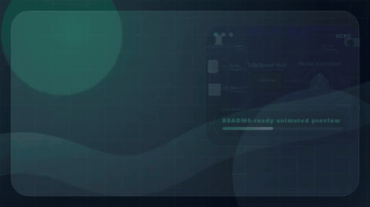
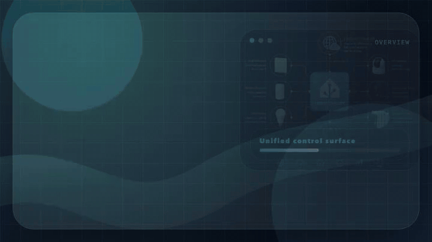
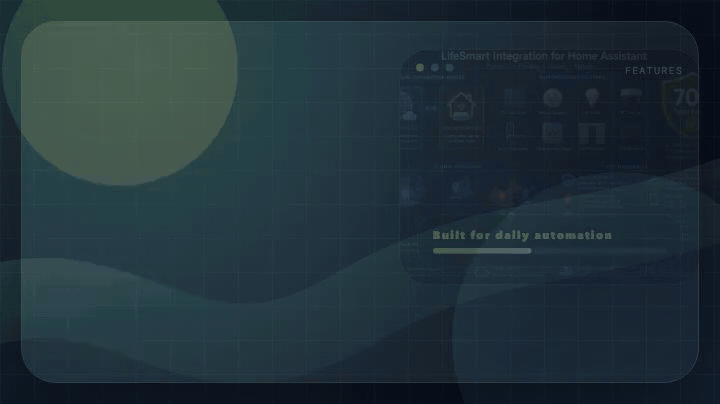
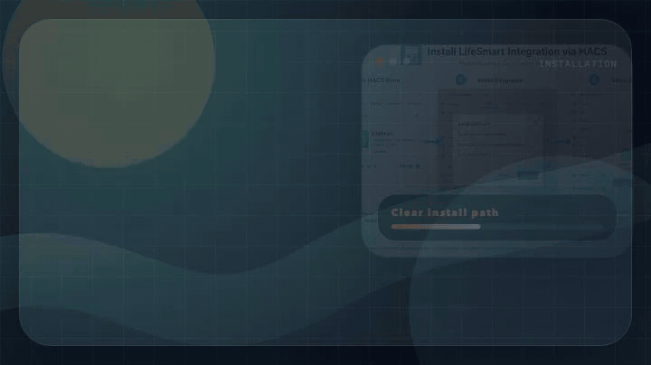
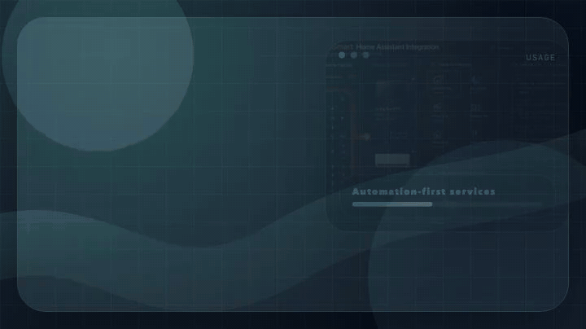
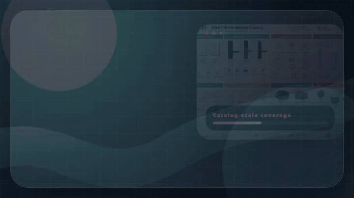
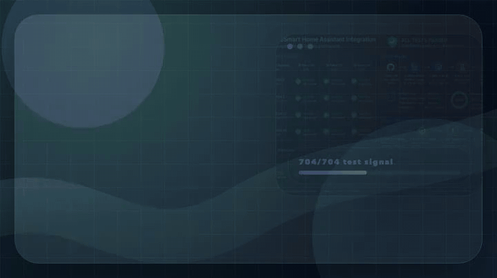

<sub>🌐 <b>English</b> · <a href="docs/README.zh-CN.md">简体中文</a> · <a href="docs/README.ja.md">日本語</a> · <a href="docs/README.ko.md">한국어</a> · <a href="docs/README.ru.md">Русский</a></sub>

<div align="center">

# LifeSmart IoT Integration for Home Assistant

[](https://github.com/hacs/integration)

[](https://github.com/MapleEve/lifesmart-for-homeassistant/releases/latest)
[](https://github.com/MapleEve/lifesmart-for-homeassistant/stargazers)
[](https://github.com/MapleEve/lifesmart-for-homeassistant/issues)


[](https://app.fossa.com/projects/git%2Bgithub.com%2FMapleEve%2Flifesmart-for-homeassistant?ref=badge_shield)

<br>
<br>



<br>

Connect LifeSmart smart home devices to Home Assistant with Cloud and Local modes,<br>
automatic device discovery, and advanced automation services.<br>
Supports 704+ comprehensive tests across Home Assistant 2023.6.3+.

<br>

[Overview](#overview) · [Features](#features) · [Installation](#installation) · [Initialization](#initialization) · [Usage](#usage) · [Supported Devices](#supported-devices) · [Compatibility](#compatibility--testing) · [Contributing](#development--contributing)

</div>

---

## Overview



LifeSmart for Home Assistant integrates LifeSmart smart home devices with Home Assistant. It supports both Cloud and Local modes, automatic device discovery, and advanced automation via Home Assistant services. The integration supports a wide range of LifeSmart devices, including switches, sensors, locks, controllers, SPOT devices, and cameras. Installation and updates are available via HACS.

---

## Features



- **Dual Connection Modes**: Cloud and Local modes (choose between LifeSmart API or local Hub)
- **Comprehensive Device Support**: Switches, sensors, locks, controllers, sockets, curtain motors, lights, SPOT, cameras
- **Advanced Services**: Send IR keys (including A/C), trigger LifeSmart scenes, momentary switch press
- **Multi-region Support**: China, North America, Europe, Japan, Asia Pacific, Global Auto
- **Bilingual Interface**: English/Chinese UI support
- **Robust Testing**: 704+ comprehensive tests ensuring reliability
- **Version Compatibility**: Home Assistant 2023.6.3+ with automated compatibility layers

### Recent Major Improvements (May 2026)

For detailed release notes, see [CHANGELOG.md](./CHANGELOG.md).

- **☁️ Cloud Authentication**: Improved password-login handling using region returned by LifeSmart auth flow
- **🏠 Local Protocol Robustness**: Hardened local protocol decoding for nested packets
- **💡 Device Feedback Fixes**: RGBW lights, SPOT state mapping, DOOYA curtain direction/position updates
- **🔧 Compatibility Layer**: Full support for Home Assistant 2023.6.3 to 2026.05+
- **🧪 Enhanced Testing**: Completely rewritten compatibility tests with 14 dedicated test cases
- **🏗️ Code Architecture**: Unified client interfaces, split local/OAPI clients ([#66](https://github.com/MapleEve/lifesmart-HACS-for-hass/pull/66))

---

## Installation



### Install via HACS

1. In Home Assistant, go to **HACS > Integrations** > Search for "LifeSmart for Home Assistant".
2. Click **Install**.
3. After installation, click **Add Integration** and search for "LifeSmart".

[](https://my.home-assistant.io/redirect/hacs_repository/?owner=MapleEve&repository=lifesmart-for-homeassistant&category=integration)
[](https://my.home-assistant.io/redirect/config_flow_start?domain=lifesmart)

---

## Initialization


### Prerequisites

- **Cloud mode**: Register on the [LifeSmart Open Platform](http://www.ilifesmart.com/open/login) to obtain your App Key and App Token. Log in to the LifeSmart mobile app to get your User ID.
- **Local mode**: Obtain your Hub's local IP, port (default 8888), username (default admin), and password (default admin).

### Setup Steps

#### Cloud Mode

1. Select **Cloud** as the connection method.
2. Enter your App Key, App Token, User ID, select your region, and choose authentication (token or password).
3. If using password authentication, enter your LifeSmart app password to allow Home Assistant to refresh your token automatically.

#### Local Mode

1. Select **Local** as the connection method.
2. Enter your Hub's IP address, port (default 8888), username (default admin), and password (default admin).

---

## Usage



### Home Assistant Services

- **Send IR Keys**: Send IR commands to remote devices (e.g., TVs, A/Cs).
- **Send A/C Keys**: Send IR commands with power, mode, temperature, wind, and swing options to air conditioners.
- **Trigger Scene**: Activate a LifeSmart scene by specifying the hub and scene ID.
- **Press Switch**: Perform a momentary press on a switch entity for a specified duration.

Example service call (YAML):

```yaml
service: lifesmart.send_ir_keys
data:
  agt: "_xXXXXXXXXXXXXXXXXX"
  me: "sl_spot_xxxxxxxx"
  ai: "AI_IR_xxxx_xxxxxxxx"
  category: "tv"
  brand: "custom"
  keys: ["power"]
```

---

## Supported Devices



Supports a wide range of LifeSmart devices, including but not limited to:

| Category | Devices |
|----------|---------|
| **Switches** | SL_MC_ND1/2/3, SL_NATURE, SL_SW_IF1/2/3, SL_SW_ND1/2/3, SL_SW_NS1/2/3, and more |
| **Locks** | SL_LK_LS, SL_LK_GTM, SL_LK_AG, SL_LK_SG, SL_LK_YL, SL_P_BDLK, OD_JIUWANLI_LOCK1 |
| **Controllers** | SL_P, SL_JEMA |
| **Sockets/Plugs** | SL_OE_DE, SL_OE_3C, SL_OL_W, SL_OL_UK, SL_OL_UL, OD_WE_OT1 |
| **Curtain Motors** | SL_SW_WIN, SL_CN_IF, SL_CN_FE, SL_DOOYA, SL_P_V2 |
| **Lights** | SL_LI_RGBW, SL_CT_RGBW, SL_SC_RGB, SL_LI_WW, SL_SPOT, OD_WE_QUAN |
| **Sensors** | SL_SC_G, SL_SC_THL, SL_SC_CM, SL_SC_BM, SL_SC_BE, SL_SC_CQ, ELIQ_EM |
| **SPOT Devices** | MSL_IRCTL, OD_WE_IRCTL, SL_SPOT, SL_P_IR, SL_P_IR_V2 |
| **Cameras** | LSCAM:LSICAMGOS1, LSCAM:LSICAMEZ2 |

For the full list, see [const.py](https://github.com/MapleEve/lifesmart-for-homeassistant/blob/main/custom_components/lifesmart/const.py).

---

## Compatibility & Testing



### Home Assistant Version Support

| Environment | Python | Home Assistant | pytest | Test Status |
|-------------|--------|----------------|--------|-------------|
| Environment 1 | 3.11.13 | **2023.6.0** | 7.3.1 | ✅ 704/704 |
| Environment 2 | 3.12.11 | **2024.2.0** | 7.4.4 | ✅ 704/704 |
| Environment 3 | 3.13.5 | **2024.12.0** | 8.3.3 | ✅ 704/704 |
| Current | 3.13.5 | **2026.05** | 8.4.1 | ✅ 704/704 |

### Compatibility Features

- **Automatic Version Detection**: Adapts to different Home Assistant and aiohttp versions
- **WebSocket Timeout Handling**: Supports both legacy float timeouts and modern ClientWSTimeout objects
- **Climate Entity Features**: Backward compatibility for TURN_ON/TURN_OFF attributes
- **Service Call Compatibility**: Handles both legacy and modern Home Assistant service call constructors

### Code Quality Standards

- **Black Code Formatting**: Consistent code style with 88 character line length
- **Flake8 Linting**: Comprehensive code quality checks
- **CI/CD Pipeline**: Automated testing across multiple Python and Home Assistant versions

---

## Development & Contributing


### Development Setup

```bash
git clone https://github.com/MapleEve/lifesmart-HACS-for-hass.git
cd lifesmart-HACS-for-hass

# Traditional venv
python -m venv venv
source venv/bin/activate
pip install -r requirements.txt
pip install black flake8 pytest

# Or conda environments (recommended for multi-version testing)
conda create -n ci-test-ha2023.6.0-py3.11 python=3.11
conda create -n ci-test-ha2024.2.0-py3.12 python=3.12
conda create -n ci-test-ha2024.12.0-py3.13 python=3.13
```

### Testing

```bash
./.testing/test_ci_locally.sh        # interactive multi-environment test
pytest custom_components/lifesmart/  # run tests
black custom_components/lifesmart/   # format code
flake8 custom_components/lifesmart/  # lint code
```

### Contributing Guidelines

- Follow Black formatting with 88 character line length
- Add comprehensive tests for new features
- Update documentation for user-facing changes
- Use conventional commit messages
- Reference relevant issues in pull requests

See our [PR template](.github/PULL_REQUEST_TEMPLATE.md) for details.

---

## License

[](https://app.fossa.com/projects/git%2Bgithub.com%2FMapleEve%2Flifesmart-for-homeassistant?ref=badge_large)
