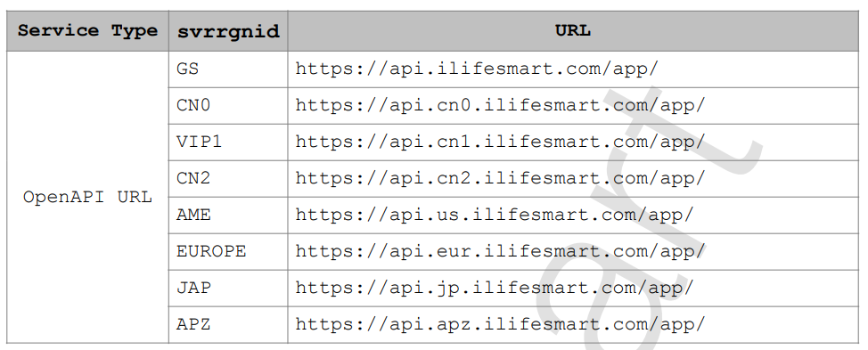
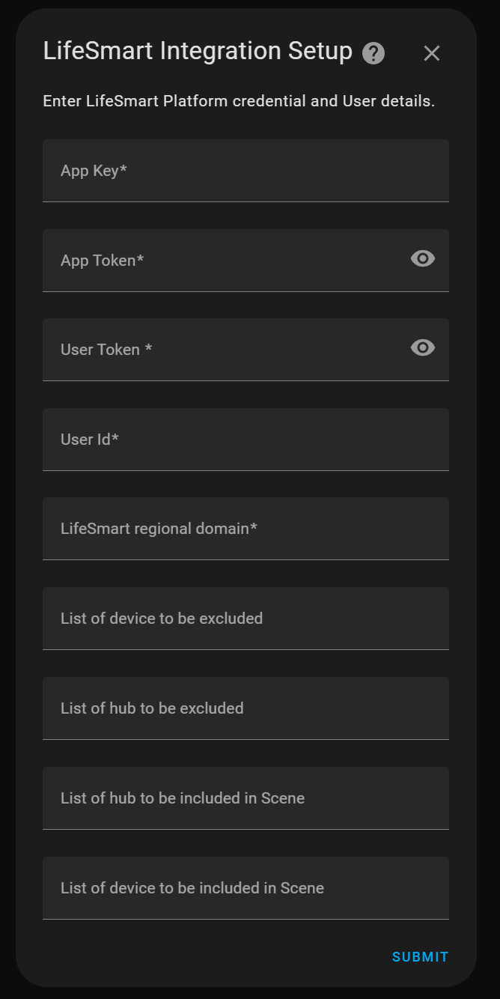
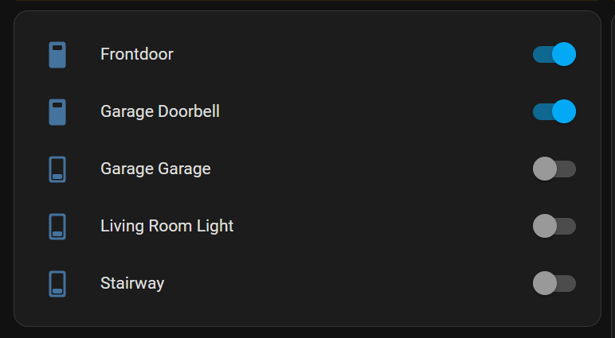
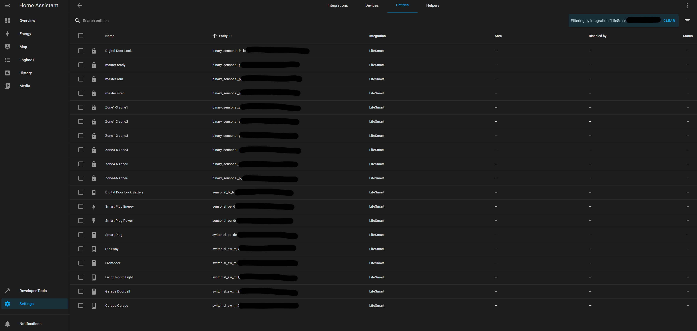
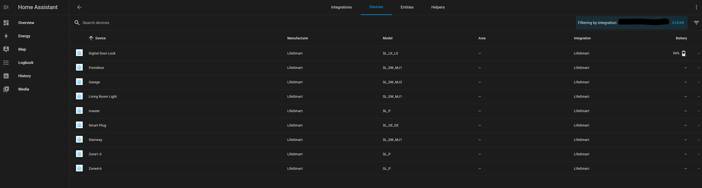
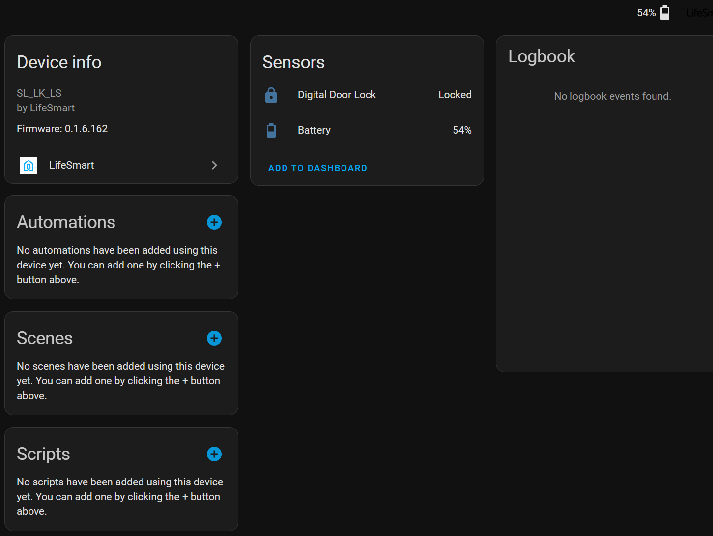

# LifeSmart for Home Assistant 集成

[](https://github.com/hacs/integration)

[](https://github.com/MapleEve/lifesmart-for-homeassistant/releases/latest)
[](https://github.com/MapleEve/lifesmart-for-homeassistant/stargazers)
[](https://github.com/MapleEve/lifesmart-for-homeassistant/issues)


> 这是中文版文档。如需英文版，请参见 [README.md](./README.md)。

---

## 概述

LifeSmart for Home Assistant 是一款强大的智能家居集成插件，可将 LifeSmart 设备无缝接入 Home
Assistant。支持云端与本地两种模式，自动发现设备，并通过 Home Assistant 服务实现高级自动化。插件支持丰富的 LifeSmart
设备类型，包括开关、传感器、门锁、控制器、SPOT 超级碗、摄像头等。支持 HACS 一键安装与升级。

---

## 主要特性

支持云端与本地模式（可选 LifeSmart API 或本地中枢），自动发现设备，广泛支持开关、传感器、门锁、控制器、插座、窗帘电机、灯光、SPOT
超级碗、摄像头等。支持 Home Assistant 服务（红外遥控、场景触发、开关点动），多区域（中国、北美、欧洲、日本、亚太、全球自动），中英文双语界面。近期优化包括设备注册、WebSocket
SSL 支持、自动错误处理、代码结构优化。

---

## 安装方法

### HACS 安装

1. 在 Home Assistant 中进入 HACS > 集成 > 搜索“LifeSmart for Home Assistant”。
2. 点击“安装”。
3. 安装完成后，点击“添加集成”，搜索“LifeSmart”。

[](https://my.home-assistant.io/redirect/hacs_repository/?owner=MapleEve&repository=lifesmart-for-homeassistant&category=integration)
[](https://my.home-assistant.io/redirect/config_flow_start?domain=lifesmart)

---

## 初始化配置

### 前置条件

云端模式：需在 [LifeSmart 开放平台](http://www.ilifesmart.com/open/login) 注册新应用，获取 App Key 和 App Token，并在手机
App 设置中获取 User ID。  
本地模式：需获取中枢网关的本地 IP、端口（默认 8888）、用户名（默认 admin）、密码（默认 admin）。

### 配置步骤

#### 云端模式

1. 选择“云端”作为连接方式。
2. 输入 App Key、App Token、User ID，选择区域，并选择认证方式（令牌或密码）。
3. 若选择密码认证，需输入 LifeSmart App 密码，Home Assistant 会自动刷新令牌。

#### 本地模式

1. 选择“本地”作为连接方式。
2. 输入网关 IP、端口（默认 8888）、用户名（默认 admin）、密码（默认 admin）。

---

## 使用说明

### Home Assistant 服务

发送红外按键（如电视、空调）、发送空调按键（支持电源、模式、温度、风速、摆风）、触发场景（指定中枢和场景 ID）、点动开关（指定持续时间）。

服务调用示例（YAML）：

```yaml
service: lifesmart.send_ir_keys
data:
  agt: "_xXXXXXXXXXXXXXXXXX"
  me: "sl_spot_xxxxxxxx"
  ai: "AI_IR_xxxx_xxxxxxxx"
  category: "tv"
  brand: "custom"
  keys: [ "power" ]
```

---

## 支持设备

插件支持丰富的 LifeSmart 设备类型，包括但不限于：

开关类：SL_MC_ND1、SL_MC_ND2、SL_MC_ND3、SL_NATURE、SL_P_SW、SL_S、SL_SF_IF1、SL_SF_IF2、SL_SF_IF3、SL_SF_RC、SL_SPWM、SL_SW_CP1、SL_SW_CP2、SL_SW_CP3、SL_SW_DM1、SL_SW_FE1、SL_SW_FE2、SL_SW_IF1、SL_SW_IF2、SL_SW_IF3、SL_SW_MJ1、SL_SW_MJ2、SL_SW_MJ3、SL_SW_ND1、SL_SW_ND2、SL_SW_ND3、SL_SW_RC、SL_SW_RC1、SL_SW_RC2、SL_SW_RC3、SL_SW_NS1、SL_SW_NS2、SL_SW_NS3、V_IND_S

门锁类：SL_LK_LS、SL_LK_GTM、SL_LK_AG、SL_LK_SG、SL_LK_YL、SL_P_BDLK、OD_JIUWANLI_LOCK1

控制器类：SL_P、SL_JEMA

插座类：SL_OE_DE、SL_OE_3C、SL_OL_W、OD_WE_OT1、SL_OL、SL_OL_3C、SL_OL_DE、SL_OL_UK、SL_OL_UL

窗帘电机类：SL_SW_WIN、SL_CN_IF、SL_CN_FE、SL_DOOYA、SL_P_V2

灯光类：SL_LI_RGBW、SL_CT_RGBW、SL_SC_RGB、OD_WE_QUAN、SL_LI_WW、SL_LI_GD1、SL_LI_UG1、MSL_IRCTL、OD_WE_IRCTL、SL_SPOT、SL_P_IR

传感器类：SL_SC_G、SL_SC_BG、SL_SC_MHW、SL_SC_CM、SL_SC_BM、SL_P_RM、SL_SC_THL、SL_SC_BE、SL_SC_CQ、SL_SC_CA、SL_SC_B1、SL_SC_WA、SL_SC_CH、SL_SC_CP、ELIQ_EM、SL_P_A、SL_DF_GG、SL_DF_MM、SL_DF_SR、SL_DF_BB、SL_SC_CN

SPOT 超级碗：MSL_IRCTL、OD_WE_IRCTL、SL_SPOT、SL_P_IR、SL_P_IR_V2

摄像头类：LSCAM:LSICAMGOS1、LSCAM:LSICAMEZ2

完整设备列表请参考 [代码库 const.py 文件](https://github.com/MapleEve/lifesmart-for-homeassistant/blob/main/custom_components/lifesmart/const.py)。

---

## 图例

以下为文档引用的示例图例和截图，请确保这些图片已存在于仓库或根据需要补充。

**LifeSmart 服务器区域**



**配置示例截图**






