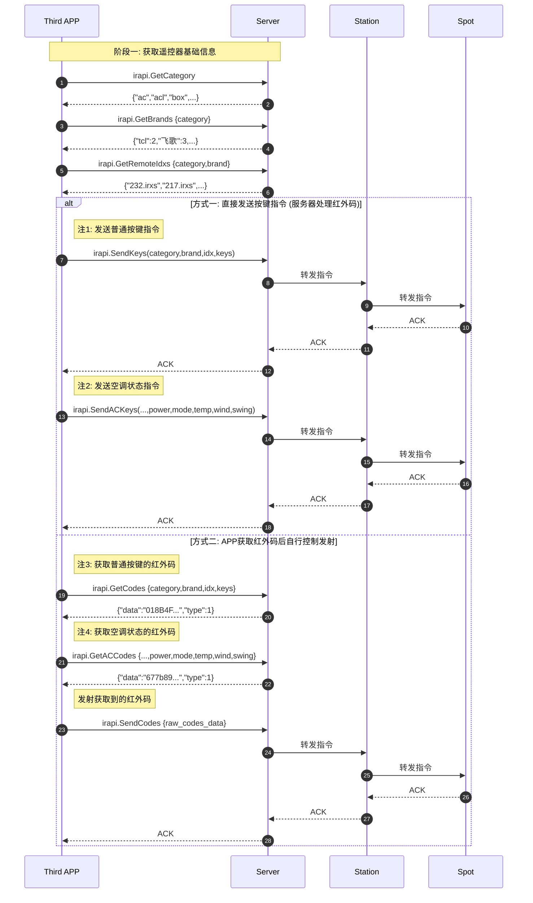

本文档由 LifeSmart提供，@MapleEve 重构为 Markdown 格式
此文档对应 1.12，Jon Fan 在 2019 年 5 月 17 日更新的官方文档

## 1.前言

LifeSmart超级碗(SPOT)，是LifeSmart公司推出的一款高颜值家居产品，它通过学习生活中红外遥控器将繁杂的遥控超级碗揽括其中，让用户体验便捷的生活。

本文介绍了LifeSmart超级碗(SPOT)
对外接口，使得第三方应用可以方便快捷的对LifeSmart超级碗进行操作，用户可以往Sendkeys接口输入category，brand，idx，keys四个变量将红外码发送给超级碗，实现对家电的控制。这里的category，brand，idx可分别通过GetCategory，GetBrands，GetRemoteldxs获取，idx，keys分别表示遥控器的索引和遥控器按键。而用户还可以使用LifeSmart超级碗对外接口，添加多个遥控器到超级碗，以及对遥控器的管理等操作。更多API的介绍请参考正文。

本文档所列举API仅针对超级碗SPOT(万能遥控器)操作，HTTPS请求数据格式规范以及数据签名方式请参考《LifeSmart云平台服务接口》

其中GetCategory、GetBrands、GetRemoteldxs、GetCodes、GetACCodes方法不涉及对用户的操作，故其签名中的userid和usertoken使用默认值userid="
10001"，usertoken="10001"

## 2.LifeSmart超级碗(SPOT)OpenAPI交互流程图

**超级碗 SPOT交互流程：**



**流程说明：**

* **关于控制方式 (注1 和 注2)**
    * 图中 `注1` 和 `注2` 解释了当第三方应用调用 `SendKeys` (发送普通按键) 或 `SendACKeys` (发送空调状态) 时，服务器(
      Server) backend 可通过**两种不同路径**来控制最终的执行设备“超级碗(Spot)”。
    * **注1**: 表示服务器通过**LifeSmart智慧中心(Station)**对超级碗进行中继控制。
    * **注2**: 表示服务器**直接**对超级碗进行控制，不经过Station。

* **关于红外码获取 (注3 和 注4)**
    * **注3** 和 **注4** 分别是获取“普通按键红外码”和“空调状态红外码”的API。
    * 由于空调遥控器比较特殊，它发送的红外码（俗称“全码”）包含了**当前的所有状态**
      （如温度、模式、风速等），而并非单个按键的功能码，因此在API设计上对这两者做了区分。

**推荐使用方式：**

推荐第三方应用使用SendKeys和SendACKeys，当需要深入定制时，才使用GetCodes、GetACCodes、和SendCodes方法对超级碗进行控制。

## 3.LifeSmart遥控器API介绍

## 3.1.GetCategory 获取支持的遥控器种类

### 3.1.1.JSON请求数据格式

### 接口定义: GetCategory

| 类型                  | 定义                | 必须 | 描述                                                            |
|:--------------------|:------------------|:---|:--------------------------------------------------------------|
| Interface Name      | GetCategory       |    | 获取支持的遥控器种类                                                    |
| Partial URL         | irapi.GetCategory | Y  |                                                               |
| Content Type        | application/json  | Y  |                                                               |
| HTTP Method         | HTTP POST         | Y  |                                                               |
| **Request Content** | **system**        |    |                                                               |
|                     | &emsp;`ver`       | Y  | 1.0                                                           |
|                     | &emsp;`lang`      | Y  | en                                                            |
|                     | &emsp;`sign`      | Y  | 签名值                                                           |
|                     | &emsp;`userid`    | Y  | 该接口不涉及用户操作, 这里的userid为固定值"10001", 签名时用到的usertoken也为固定值"10001" |
|                     | &emsp;`appkey`    | Y  | appkey                                                        |
|                     | &emsp;`did`       | O  | (可选)终端唯一id                                                    |
|                     | &emsp;`time`      | Y  | UTC时间戳, 自1970年1月1日起计算的时间, 单位为秒                                |
|                     | **method**        | Y  | GetCategory                                                   |
|                     | **id**            | Y  | 消息id号                                                         |

### 3.1.2.范例

⚫ 我们假定：

appkey为APPKEY_XXXXXXXX，实际需要填写真实数据；  
apptoken为APPTOKEN_XXXXXXXX，实际需要填写真实数据；  
sign为SIGN_xXXXXXXX, 实际需要填写真实签名数据；

• 请求地址：svrurl+PartialURL，例如：`https://api.ilifesmart.com/app/irapi.Getcategory`

• 请求信息：

```json
{
  "id": 957,
  "method": "GetCategory",
  "system": {
    "ver": "1.0",
    "lang": "en",
    "userid": "10001",
    "appkey": "APPKEY_xxxxxxxx",
    "time": 1447641115,
    "sign": "SIGN_xxxxxxxx"
  }
```

• 签名原始字符串：

- method:GetCategory, time:1447641115, userid:10001, usertoken:10001, appkey:APPKEY_xxxxxxxX,apptoken:APPTOKEN_xxxxxxxX

回复信息：   
`{ "id": 957, "code": 0, "message":["ac","acl","box","stb","tv",…]`

#### 提示：类型说明

ac:空调；  
acl:空气净化器；  
box:网络盒子；  
dvd:录像机；  
fan:风扇；  
stb:机顶盒；  
tv:电视机；

## 3.2.GetBrands 获取相应种类的遥控器品牌列表

### 3.2.1.JSON请求数据格式

### 接口定义: GetBrands

| 类型                  | 定义               | 必须 | 描述                                                            |
|:--------------------|:-----------------|:---|:--------------------------------------------------------------|
| Interface Name      | GetBrands        |    | 获取相应种类的遥控器品牌列表                                                |
| Partial URL         | irapi.GetBrands  | Y  |                                                               |
| Content Type        | application/json | Y  |                                                               |
| HTTP Method         | HTTP POST        | Y  |                                                               |
| **Request Content** | **system**       |    |                                                               |
|                     | &emsp;`ver`      | Y  | 1.0                                                           |
|                     | &emsp;`lang`     | Y  | en                                                            |
|                     | &emsp;`sign`     | Y  | 签名值                                                           |
|                     | &emsp;`userid`   | Y  | 该接口不涉及用户操作, 这里的userid为固定值"10001", 签名时用到的usertoken也为固定值"10001" |
|                     | &emsp;`appkey`   | Y  | appkey                                                        |
|                     | &emsp;`did`      | O  | (可选)终端唯一id                                                    |
|                     | &emsp;`time`     | Y  | UTC时间戳, 自1970年1月1日起计算的时间, 单位为秒                                |
|                     | **method**       | Y  | GetBrands                                                     |
|                     | **params**       |    |                                                               |
|                     | &emsp;`category` | Y  | 遥控器的category，请查看GetCategory的返回消息说明                            |
|                     | **id**           | Y  | 消息id号                                                         |

### 3.2.2.范例

• 我们假定：

appkey为APPKEY_XXXXXXXX，实际需要填写真实数据；  
apptoken为APPTOKEN_XXXXXXXX，实际需要填写真实数据；  
sign为SIGN_XXXXXXXX，实际需要填写真实签名数据；

• 请求地址：svrurl+PartialURL，例如：`https://api.ilifesmart.com/app/irapi.GetBrands`

• 请求信息：

```json
{
  "id": 957,
  "method": "GetBrands",
  "params": {
    "category": "tv"
  },
  "system": {
    "ver": "1.0",
    "lang": "en",
    "userid": "10001",
    "appkey": "APPKEY_xxxxxxxx",
    "time": 1447641115,
    "sign": "SIGN_xxxxxxxx"
  }
}
```

• 签名原始字符串：

- method:GetBrands, category:tv, time:1447641115, userid:10001, usertoken:10001, appkey:APPKEY_xxxxxxxx, apptoken:
  APPTOKEN_xxxxxxxx

• 回复信息：   
`{ "id": 957, "code": 0, "message": { "data":{"tcl":2,"飞歌":3,"bosch":1,"东新宝":4,"ELCo":2,...}, "params":{"category":"tv"} } }`

提示：返回数据data格式为：

"data":{"brand":num,"brand":num,"brand":num, …},"params": {.}  
num表示该brand(品牌）下有num个遥控器；  
params返回的是用户输入参数；  
例如："tcl"：2表示tcl品牌下有2个遥控器，  
"category"："tv"表示用户输入的参数是查询电视机遥控器。

## 3.3.GetRemoteldxs 获取相应的遥控器索引l列表

### 3.3.1.JSON请求数据格式

### 接口定义: GetRemoteIdxs

| 类型                  | 定义                  | 必须 | 描述                                                          |
|:--------------------|:--------------------|:---|:------------------------------------------------------------|
| Interface Name      | GetRemoteIdxs       |    | 获取相应的遥控器的索引列表                                               |
| Partial URL         | irapi.GetRemoteIdxs | Y  |                                                             |
| Content Type        | application/json    | Y  |                                                             |
| HTTP Method         | HTTP POST           | Y  |                                                             |
| **Request Content** | **system**          |    |                                                             |
|                     | &emsp;`ver`         | Y  | 1.0                                                         |
|                     | &emsp;`lang`        | Y  | en                                                          |
|                     | &emsp;`sign`        | Y  | 签名值                                                         |
|                     | &emsp;`userid`      | Y  | 该接口不涉及用户操作，这里的userid为固定值"10001"，签名时用到的usertoken也为固定值"10001" |
|                     | &emsp;`appkey`      | Y  | appkey                                                      |
|                     | &emsp;`did`         | O  | (可选)终端唯一id                                                  |
|                     | &emsp;`time`        | Y  | UTC时间戳，自1970年1月1日起计算的时间，单位为秒                                |
|                     | **method**          | Y  | GetRemoteIdxs                                               |
|                     | **params**          |    |                                                             |
|                     | &emsp;`category`    | Y  | 遥控器的category，请查看GetCategory的返回消息                            |
|                     | &emsp;`brand`       | Y  | 遥控器的brand，请查看GetBrands的返回消息                                 |
|                     | **id**              | Y  | 消息id号                                                       |

### 3.3.2.范例

• 我们假定：

appkey为APPKEY_XXXXXXXX，实际需要填写真实数据；  
apptoken为APPTOKEN_XXXXXXXX，实际需要填写真实数据；  
sign为SIGN_XXXXXXXX，实际需要填写真实签名数据；

• 请求地址：svrurl+PartialURL，例如：`https://api.ilifesmart.com/app/irapi.GetRemoteIdxs`

• 请求信息：

```json
{
  "id": 957,
  "method": "GetRemoteIdxs",
  "params": {
    "category": "tv",
    "brand": "tcl"
  },
  "system": {
    "ver": "1.0",
    "lang": "en",
    "userid": "10001",
    "appkey": "APPKEY_xxxxxxxx",
    "time": 1447641115,
    "sign": "SIGN_xxxxxxxx"
  }
}
```

• 签名原始字符串：

- method:GetRemoteIdxs, brand:tcl, category:tv, time:1447641115, userid:10001, usertoken:10001, appkey:APPKEY_xxxxxxxx,
  apptoken:APPTOKEN_xxxxxxxx

• 回复信息：

```json
{
  "code": 0,
  "id": 957,
  "message": {
    "data": [
      "186.irxs",
      "205.irxs",
      "066.irxs",
      ...
    ],
    "params": {
      "category": "tv",
      "brand": "tcl"
    }
  }
}
```

## 3.4.GetRemoteList 获取超级碗上的遥控器列表

### 3.4.1.JSON请求数据格式

### 接口定义: GetRemoteList

| 类型                  | 定义                  | 必须 | 描述                               |
|:--------------------|:--------------------|:---|:---------------------------------|
| Interface Name      | GetRemoteList       |    | 获取超级碗上的遥控器列表                     |
| Partial URL         | irapi.GetRemoteList | Y  |                                  |
| Content Type        | application/json    | Y  |                                  |
| HTTP Method         | HTTP POST           | Y  |                                  |
| **Request Content** | **system**          |    |                                  |
|                     | &emsp;`ver`         | Y  | 1.0                              |
|                     | &emsp;`lang`        | Y  | en                               |
|                     | &emsp;`sign`        | Y  | 签名值                              |
|                     | &emsp;`userid`      | Y  | User ID                          |
|                     | &emsp;`appkey`      | Y  | appkey                           |
|                     | &emsp;`did`         | O  | (可选)终端唯一id                       |
|                     | &emsp;`time`        | Y  | UTC时间戳，自1970年1月1日起计算的时间，单位为秒     |
|                     | **method**          | Y  | GetRemoteList                    |
|                     | **params**          |    |                                  |
|                     | &emsp;`agt`         | Y  | 欲查询的超级碗的agt，请查看EpGetAllAgts的返回消息 |
|                     | **id**              | Y  | 消息id号                            |

### 3.4.2.范例

⚫ 我们假定：

appkey为APPKEY_XXXXXXXX，实际需要填写真实数据；  
apptoken为APPTOKEN_XXXXXXXX，实际需要填写真实数据；  
usertoken为USERTOKEN_XXXXXXXX，实际需要填写真实数据；  
sign为SIGN_XXXXXXXX，实际需要填写真实签名数据；

• 请求地址：svrurl+PartialURL，例如：`https://api.ilifesmart.com/app/irapi.GetRemoteList`

• 请求信息：

```json
{
  "id": 957,
  "method": "GetRemoteList",
  "params": {
    "agt": "_3MAAG1nYTAwMDA"
  },
  "system": {
    "ver": "1.0",
    "lang": "en",
    "userid": "1111111",
    "appkey": "APPKEY_xxxxxxxx",
    "time": 1447641115,
    "sign": "SIGN_xxxxxxxx"
  }
}
```

• 签名原始字符串：

- method:GetRemoteList, agt:_3MAAG1nYTAwMDA, time:1447641115, userid:1111111, usertoken:USERTOKEN_xxxxxxxx, appkey:
  APPKEY_xxxxxxxx, apptoken:APPTOKEN_xxxxxxxx

• 回复信息：

```json
{
  "code": 0,
  "id": 957,
  "message": {
    "AI_IR_2718_1470020360": {
      "category": "box",
      "brand": "apple",
      "name": "Apple Box RC",
      "ts": 1470020360
    },
    "AI_IR_2718_1470020405": {
      "category": "tv",
      "brand": "tcl",
      "name": "TCL Remote",
      "ts": 1470020405
    },
    "AI_IR_2718_1470027934": {
      "category": "tv",
      "brand": "tcl",
      "name": "TCL Remote",
      "ts": 1470027934,
      "ext_loc": "{\"key\":\"Ls\",\"location\":\"HangZhou\"}"
    }
  }
}
```

提示：若存在ext_loc属性则将返回ext_loc属性值。

## 3.5.AddRemote 添加遥控器到超级碗

### 3.5.1.JSON请求数据格式

### 接口定义: AddRemote

| 类型                  | 定义               | 必须 | 描述                                   |
|:--------------------|:-----------------|:---|:-------------------------------------|
| Interface Name      | AddRemote        |    | 添加遥控器到超级碗                            |
| Partial URL         | irapi.AddRemote  | Y  |                                      |
| Content Type        | application/json | Y  |                                      |
| HTTP Method         | HTTP POST        | Y  |                                      |
| **Request Content** | **system**       |    |                                      |
|                     | `ver`            | Y  | 1.0                                  |
|                     | `lang`           | Y  | en                                   |
|                     | `sign`           | Y  | 签名值                                  |
|                     | `userid`         | Y  | User ID                              |
|                     | `appkey`         | Y  | appkey                               |
|                     | `did`            | O  | (可选)终端唯一id                           |
|                     | `time`           | Y  | UTC时间戳，自1970年1月1日起计算的时间，单位为秒         |
|                     | **method**       | Y  | AddRemote                            |
|                     | **params**       |    |                                      |
|                     | `agt`            | Y  | 欲操作的超级碗的agt，请查看EpGetAllAgts的返回消息     |
|                     | `me`             | Y  | 欲操作的超级碗的me，请查看EpGetAll的返回消息          |
|                     | `category`       | Y  | 欲添加的遥控器的category，请查看GetCategory的返回消息 |
|                     | `brand`          | Y  | 欲添加的遥控器的brand，请查看GetBrands的返回消息      |
|                     | `idx`            | Y  | 欲添加的遥控器的idx，请查看GetRemoteIdxs的返回消息    |
|                     | `name`           | Y  | 欲添加的遥控器名称                            |
|                     | `ext_loc`        | O  | 欲设置的遥控器扩展配置                          |
|                     | **id**           | Y  | 消息id号                                |

### 3.5.2.范例

⚫ 我们假定：

appkey为APPKEY_XXXXXXXX，实际需要填写真实数据；  
apptoken为APPTOKEN_XXXXXXXX，实际需要填写真实数据；  
usertoken为USERTOKEN_XXXXXXXX，实际需要填写真实数据；  
sign为SIGN_XXXXXXXX，实际需要填写真实签名数据；

• 请求地址：svrurl+PartialURL，例如：`https://api.ilifesmart.com/app/irapi.AddRemote`

• 请求信息：

```json
{
  "id": 957,
  "method": "AddRemote",
  "params": {
    "agt": "_3MAAG1nYTAwMDA",
    "me": "2718",
    "category": "tv",
    "brand": "tcl",
    "idx": "005.irxs",
    "name": "TCLRemote"
  },
  "system": {
    "ver": "1.0",
    "lang": "en",
    "userid": "1111111",
    "appkey": "APPKEY_xxxxxxxx",
    "time": 1447641115,
    "sign": "SIGN_xxxxxxxx"
  }
}
```

• 签名原始字符串：

- method:AddRemote, agt:_3MAAG1nYTAwMDA, brand:tcl, category:tv, idx:005.irxs, me:2718, name:TCLRemote, time:1447641115,
  userid:1111111, usertoken:USERTOKEN_xxxxxxxx, appkey:APPKEY_xxxxxxxx, apptoken:APPTOKEN_xxxxxxxx

• 回复信息：

```json
{
  "code": 0,
  "id": 957,
  "message": "AI_IR_2718_1470028017"
}
```

注意：若执行命令成功也即code等于o，则返回的message信息是创建的遥控器的ID。

## 3.6. DelRemote 从超级碗删除遥控器

### 3.6.1.JSON请求数据格式

### 接口定义: DelRemote

| 类型                  | 定义               | 必须 | 描述                               |
|:--------------------|:-----------------|:---|:---------------------------------|
| Interface Name      | DelRemote        |    | 从超级碗删除遥控器                        |
| Partial URL         | irapi.DelRemote  | Y  |                                  |
| Content Type        | application/json | Y  |                                  |
| HTTP Method         | HTTP POST        | Y  |                                  |
| **Request Content** | **system**       |    |                                  |
|                     | `ver`            | Y  | 1.0                              |
|                     | `lang`           | Y  | en                               |
|                     | `sign`           | Y  | 签名值                              |
|                     | `userid`         | Y  | User ID                          |
|                     | `appkey`         | Y  | appkey                           |
|                     | `did`            | O  | (可选)终端唯一id                       |
|                     | `time`           | Y  | UTC时间戳，自1970年1月1日起计算的时间，单位为秒     |
|                     | **method**       | Y  | DelRemote                        |
|                     | **params**       |    |                                  |
|                     | `agt`            | Y  | 欲操作的超级碗的agt，请查看EpGetAllAgts的返回消息 |
|                     | `id`             | Y  | 欲删除的遥控器的id，请查看GetRemoteList的返回消息 |
|                     | **id**           | Y  | 消息id号                            |

### 3.6.2.范例

⚫ 我们假定：

appkey为APPKEY_XXXXXXXX，实际需要填写真实数据；  
apptoken为APPTOKEN_XXXXXXXX，实际需要填写真实数据；  
usertoken为USERTOKEN_XXXXXXXX，实际需要填写真实数据；  
sign为SIGN_XXXXXXXX，实际需要填写真实签名数据；

• 请求地址：svrurl+PartialURL，例如：`https://api.ilifesmart.com/app/irapi.DelRemote`

• 请求信息：

```json
{
  "id": 957,
  "method": "DelRemote",
  "params": {
    "agt": "_3MAAG1nYTAwMDA",
    "id": "AI_IR_2718_1470028017"
  },
  "system": {
    "ver": "1.0",
    "lang": "en",
    "userid": "1111111",
    "appkey": "APPKEY_xxxxxxxx",
    "time": 1447641115,
    "sign": "SIGN_xxxxxxxx"
  }
}
```

• 签名原始字符串：

- method:DelRemote, agt:_3MAAG1nYTAwMDA, id:AI_IR_2718_1470028017, time:1447641115, userid:1111111, usertoken:
  USERTOKEN_xxxxxxxx, appkey:APPKEY_xxxxxxxx, apptoken:APPTOKEN_xxxxxxxx

• 回复信息：

```json
{
  "code": 0,
  "id": 957,
  "message": "ok"
}
```

## 3.7.SetRemoteName 修改超级碗上遥控器的名称

### 3.7.1.JSON请求数据格式

### 接口定义: SetRemoteName

| 类型                  | 定义                  | 必须 | 描述                               |
|:--------------------|:--------------------|:---|:---------------------------------|
| Interface Name      | SetRemoteName       |    | 修改超级碗上遥控器的名称                     |
| Partial URL         | irapi.SetRemoteName | Y  |                                  |
| Content Type        | application/json    | Y  |                                  |
| HTTP Method         | HTTP POST           | Y  |                                  |
| **Request Content** | **system**          |    |                                  |
|                     | `ver`               | Y  | 1.0                              |
|                     | `lang`              | Y  | en                               |
|                     | `sign`              | Y  | 签名值                              |
|                     | `userid`            | Y  | User ID                          |
|                     | `appkey`            | Y  | appkey                           |
|                     | `did`               | O  | (可选)终端唯一id                       |
|                     | `time`              | Y  | UTC时间戳，自1970年1月1日起计算的时间，单位为秒     |
|                     | **method**          | Y  | SetRemoteName                    |
|                     | **params**          |    |                                  |
|                     | `agt`               | Y  | 欲操作的超级碗的agt，请查看EpGetAllAgts的返回消息 |
|                     | `id`                | Y  | 欲设置的遥控器的id，请查看GetRemoteList的返回消息 |
|                     | `name`              | Y  | 需设置的遥控器的名称                       |
|                     | **id**              | Y  | 消息id号                            |

### 3.7.2.范例

⚫ 我们假定：

appkey为APPKEY_XXXXXXXX，实际需要填写真实数据；  
apptoken为APPTOKEN_XXXXXXXX，实际需要填写真实数据；  
usertoken为USERTOKEN_XXXXXXXX，实际需要填写真实数据；  
sign为SIGN_xXxXXXXX, 实际需要填写真实签名数据；

• 请求地址：svrurl+PartialURL，例如：`https://api.ilifesmart.com/app/irapi.SetRemoteName`

• 请求信息：

```json
{
  "id": 957,
  "method": "SetRemoteName",
  "params": {
    "agt": "_3MAAG1nYTAwMDA",
    "id": "AI_IR_2718_1470028017",
    "name": "REMOTE_CONTROLLER"
  },
  "system": {
    "ver": "1.0",
    "lang": "en",
    "userid": "1111111",
    "appkey": "APPKEY_xxxxxxxx",
    "time": 1447641115,
    "sign": "SIGN_xxxxxxxx"
  }
}
```

• 签名原始字符串：

- method:SetRemoteName, agt:_3MAAG1nYTAwMDA, id:AI_IR_2718_1470028017, name:REMOTE_CONTROLLER, time:1447641115, userid:
  1111111, usertoken:USERTOKEN_xxxxxxxx, appkey:APPKEY_xxxxxxxx, apptoken:APPTOKEN_xxxxxxxx

• 回复信息：

```json
{
  "code": 0,
  "id": 957,
  "message": "success"
}
```

提示：如何修改遥控器的ext_loc属性？

SetRemoteName接口支持修改遥控器的ext_loc属性的值。若需要修改遥控器ext_loc值，请指明 `{agt,id,ext_loc}` 属性；
例如 `{agt="_3MAAG1nYTAwMDA",id="AI_IR_2718_1470028017", ext_loc="{\"key\": \"LS\", \"location\": \"HangZhou\"}"}`
说明要把遥控器的ext_loc属性修改为 `"{\"key\": \"LS\", \"location\": \"HangZhou\"}"`;
注意：ext_loc属性可以与name属性一起修改，同时指明它们的值即可。

## 3.8.SendKeys 发送普通遥控器的按键指令

### 3.8.1.JSON请求数据格式

### 接口定义: SendKeys

| 类型                  | 定义               | 必须 | 描述                                         |
|:--------------------|:-----------------|:---|:-------------------------------------------|
| Interface Name      | SendKeys         |    | 发送普通遥控器的按键指令                               |
| Partial URL         | irapi.SendKeys   | Y  |                                            |
| Content Type        | application/json | Y  |                                            |
| HTTP Method         | HTTP POST        | Y  |                                            |
| **Request Content** | **system**       |    |                                            |
|                     | `ver`            | Y  | 1.0                                        |
|                     | `lang`           | Y  | en                                         |
|                     | `sign`           | Y  | 签名值                                        |
|                     | `userid`         | Y  | User ID                                    |
|                     | `appkey`         | Y  | appkey                                     |
|                     | `did`            | O  | (可选)终端唯一id                                 |
|                     | `time`           | Y  | UTC时间戳，自1970年1月1日起计算的时间，单位为秒               |
|                     | **method**       | Y  | SendKeys                                   |
|                     | **params**       |    |                                            |
|                     | `agt`            | Y  | 欲操作的超级碗的agt，请查看EpGetAllAgts的返回消息           |
|                     | `me`             | Y  | 欲操作的超级碗的me，请查看EpGetAll的返回消息                |
|                     | `category`       | Y  | 欲操作的遥控器的category，请查看GetCategory的返回消息       |
|                     | `brand`          | Y  | 欲操作的遥控器的brand，请查看GetBrands的返回消息            |
|                     | `idx`            | O  | 欲操作的遥控器的idx，请查看GetRemoteIdxs的返回消息          |
|                     | `ai`             | O  | 欲操作的遥控器的id（超级碗已经建好的），请查看GetRemoteList的返回消息 |
|                     | `keys`           | Y  | 相应遥控器的键值，需要列表转化成JSON格式字符串赋值给keys，并参加签名     |
|                     | **id**           | Y  | 消息id号                                      |

#### 【Notes】

• keys：可填入多个键值

例如："keys"："[\"POwER\"，\"1\"，\"2\",\"3\"]"表示将向超级碗发送"POWER"，"1"，"2"，"3"四个按键

#### • idx和ai:

存在ai参数时通过现有遥控器发送键值，不存在ai参数发送idx代表通用库发送键值，两者必须要有一个存在。

格式如：  
"idx": "005.irxs"  
"ai"： "AI_IR_2713_1477029095"

### 3.8.2.范例

⚫ 我们假定：

appkey为APPKEY_XXXXXXXX，实际需要填写真实数据;  
apptoken为APPTOKEN_XXXXXXXX，实际需要填写真实数据；  
usertoken为USERTOKEN_XXXXXXXX，实际需要填写真实数据；  
sign为SIGN_XXXXXXXX，实际需要填写真实签名数据；

• 请求地址：svrurl+PartialURL，例如：`https://api.ilifesmart.com/app/irapi.SendKeys`

• 请求信息：

```json
{
  "id": 957,
  "method": "SendKeys",
  "params": {
    "agt": "_3MAAG1nYTAwMDA",
    "me": "2718",
    "category": "tv",
    "brand": "tcl",
    "idx": "005.irxs",
    "keys": "[\"POWER\",\"1\",\"2\",\"3\"]"
  },
  "system": {
    "ver": "1.0",
    "lang": "en",
    "userid": "1111111",
    "appkey": "APPKEY_xxxxxxxx",
    "time": 1447641115,
    "sign": "SIGN_xxxxxxxx"
  }
}
```

若存在"ai"参数，则params为如下：

```json
{
  "params": {
    "agt": "_3MAAG1nYTAwMDA",
    "me": "2718",
    "category": "tv",
    "brand": "tcl",
    "ai": "AI_IR_2713_1477029095",
    "keys": "[\"POWER\",\"1\",\"2\",\"3\"]"
  }
}
```

• 签名原始字符串：

若采用idx方式：

- method:SendKeys, agt:_3MAAG1nYTAwMDA, brand:tcl, category:tv, idx:005.irxs, keys:["POWER", "1", "2", "3"], me:2718,
  time:1470023215, userid:1111111, usertoken:USERTOKEN_xxxxxxxx, appkey:APPKEY_xxxxxxxx, apptoken:APPTOKEN_xxxxxxxx

若采用ai方式：

- method:SendKeys, agt:_3MAAG1nYTAwMDA, ai:AI_IR_2713_1477029095, brand:tcl, category:tv, keys:["POWER", "1", "2", "3"],
  me:2718, time:1470023215, userid:1111111, usertoken:USERTOKEN_xxxxxxxx, appkey:APPKEY_xxxxxxxx, apptoken:
  APPTOKEN_xxxxxxxx

• 回复信息：

```json
{
  "code": 0,
  "id": 957,
  "message": "ok"
}
```

## 3.9.SendACKeys发送空调遥控器指令

### 3.9.1.JSON请求数据格式

### 接口定义: SendACKeys

| 类型                  | 定义               | 必须 | 描述                                                                                                                                           |
|:--------------------|:-----------------|:---|:---------------------------------------------------------------------------------------------------------------------------------------------|
| Interface Name      | SendACKeys       |    | 发送空调遥控器指令                                                                                                                                    |
| Partial URL         | irapi.SendACKeys | Y  |                                                                                                                                              |
| Content Type        | application/json | Y  |                                                                                                                                              |
| HTTP Method         | HTTP POST        | Y  |                                                                                                                                              |
| **Request Content** | **system**       |    |                                                                                                                                              |
|                     | `ver`            | Y  | 1.0                                                                                                                                          |
|                     | `lang`           | Y  | en                                                                                                                                           |
|                     | `sign`           | Y  | 签名值                                                                                                                                          |
|                     | `userid`         | Y  | User ID                                                                                                                                      |
|                     | `appkey`         | Y  | appkey                                                                                                                                       |
|                     | `did`            | O  | (可选)终端唯一id                                                                                                                                   |
|                     | `time`           | Y  | UTC时间戳，自1970年1月1日起计算的时间，单位为秒                                                                                                                 |
|                     | **method**       | Y  | SendACKeys                                                                                                                                   |
|                     | **params**       |    |                                                                                                                                              |
|                     | `agt`            | Y  | 超级碗的agt，请查看EpGetAllAgts的返回消息                                                                                                                 |
|                     | `me`             | Y  | 欲操作的超级碗的me，请查看EpGetAll的返回消息                                                                                                                  |
|                     | `category`       | Y  | 欲操作的遥控器的category，请查看GetCategory的返回消息                                                                                                         |
|                     | `brand`          | Y  | 欲操作的遥控器的brand，请查看GetBrands的返回消息                                                                                                              |
|                     | `idx`            | O  | 欲操作的遥控器的idx，请查看GetRemoteIdxs的返回消息                                                                                                            |
|                     | `ai`             | O  | 欲操作的遥控器的id（超级碗已经建好的），请查看GetRemoteList的返回消息                                                                                                   |
|                     | `key`            | Y  | 当前键值操作方式：power:电源开关, mode:模式切换, temp:温度变化, wind:风速变化, swing:风向变化                                                                             |
|                     | `keyDetail`      | O  | 空调下发一般是全码下发，红外码会包含开关、模式、温度、风速等。但存在一些空调码库，其开关与温度、模式等设置是分离的，这个时候在power为1，key为"power"的情况下，设置keyDetail为"POWER_ONLY"可以只开启空调而不设置温度、风速等。注意：这个属性区分码库 |
|                     | `power`          | Y  | 开关(2) 1=开；0=关                                                                                                                                |
|                     | `mode`           | Y  | 运转模式(5) 0=自动 1=制冷 2=除湿 3=送风 4=制热                                                                                                             |
|                     | `temp`           | Y  | 温度(15)16-30度                                                                                                                                 |
|                     | `wind`           | Y  | 风速(4) 0=自动 1=风速1 2=风速2 3=风速3                                                                                                                 |
|                     | `swing`          | Y  | 风向(5) 0=自动 1=风向1 2=风向2 3=风向3 4=风向4                                                                                                           |
|                     | **id**           | Y  | 消息id号                                                                                                                                        |

### 3.9.2.范例

⚫ 我们假定：

appkey为APPKEY_XXXXXXXX，实际需要填写真实数据；  
apptoken为APPTOKEN_XXXXXXXX，实际需要填写真实数据；  
usertoken为USERTOKEN_XXXXXXXX，实际需要填写真实数据；  
sign为SIGN_XXXXXXXX，实际需要填写真实签名数据；

• 请求地址：svrurl+PartialURL，例如：`https://api.ilifesmart.com/app/irapi.SendACKeys`

• 请求信息：

```json
{
  "id": 957,
  "method": "SendACKeys",
  "params": {
    "agt": "_3MAAG1nYTAwMDA",
    "me": "2718",
    "category": "ac",
    "brand": "aux",
    "idx": "33.irxs",
    "key": "power",
    "power": 1,
    "mode": 1,
    "temp": 25,
    "wind": 3,
    "swing": 0
  },
  "system": {
    "ver": "1.0",
    "lang": "en",
    "userid": "1111111",
    "appkey": "APPKEY_xxxxxxxx",
    "time": 1447641115,
    "sign": "SIGN_xxxxxxxx"
  }
}
```

若存在"ai"参数，则params为如下：

```json
{
  "params": {
    "agt": "_3MAAG1nYTAwMDA",
    "me": "2718",
    "category": "ac",
    "brand": "aux",
    "ai": "AI_IR_2713_1477029095",
    "key": "power",
    "power": 1,
    "mode": 1,
    "temp": 25,
    "wind": 3,
    "swing": 0
  }
}
```

• 签名原始字符串：

若采用idx方式：

- method:SendACKeys, agt:_3MAAG1nYTAwMDA, brand:aux, category:ac, idx:33.irxs, key:power, me:2718, mode:1, power:1,
  swing:0, temp:25, wind:3, time:1470026010, userid:1111111, usertoken:USERTOKEN_xxxxxxxx, appkey:APPKEY_xxxxxxxx,
  apptoken:APPTOKEN_xxxxxxxx

若采用ai方式：

- method:SendACKeys, agt:_3MAAG1nYTAwMDA, ai:AI_IR_2713_1477029095, brand:aux, category:ac, key:power, me:2718, mode:1,
  power:1, swing:0, temp:25, wind:3, time:1470026010, userid:1111111, usertoken:USERTOKEN_xxxxxxxx, appkey:
  APPKEY_xxxxxxxx, apptoken:APPTOKEN_xxxxxxxx

• 回复信息：

```json
{
  "code": 0,
  "id": 957,
  "message": "ok"
}
```

## 3.10.GetCustomKeys 获取自定义遥控器按键列表

### 3.10.1.JSON请求数据格式

### 接口定义: GetCustomKeys

| 类型                  | 定义                  | 必须 | 描述                                      |
|:--------------------|:--------------------|:---|:----------------------------------------|
| Interface Name      | GetCustomKeys       |    | 获取自定义遥控器按键列表                            |
| Partial URL         | irapi.GetCustomKeys | Y  |                                         |
| Content Type        | application/json    | Y  |                                         |
| HTTP Method         | HTTP POST           | Y  |                                         |
| **Request Content** | **system**          |    |                                         |
|                     | `ver`               | Y  | 1.0                                     |
|                     | `lang`              | Y  | en                                      |
|                     | `sign`              | Y  | 签名值                                     |
|                     | `userid`            | Y  | User ID                                 |
|                     | `appkey`            | Y  | appkey                                  |
|                     | `did`               | O  | (可选)终端唯一id                              |
|                     | `time`              | Y  | UTC时间戳，自1970年1月1日起计算的时间，单位为秒            |
|                     | **method**          | Y  | GetCustomKeys                           |
|                     | **params**          |    |                                         |
|                     | `agt`               | Y  | 超级碗的agt，请查看EpGetAllAgts的返回消息            |
|                     | `ai`                | Y  | 超级碗上已创建的自定义遥控器的id，请查看GetRemoteList的返回消息 |
|                     | `category`          | Y  | 遥控器的category，请查看GetRemoteList的返回消息      |
|                     | `brand`             | Y  | 遥控器的brand，请查看GetRemoteList的返回消息         |
|                     | **id**              | Y  | 消息id号                                   |

### 3.10.2.范例

⚫ 我们假定：

appkey为APPKEY_XXXXXXXX，实际需要填写真实数据；  
apptoken为APPTOKEN_XXXXXXXX，实际需要填写真实数据；  
usertoken为USERTOKEN_XXXXXXXX，实际需要填写真实数据；  
sign为SIGN_XXXXXXXX，实际需要填写真实签名数据；

• 请求地址：svrurl+PartialURL，例如：`https://api.ilifesmart.com/app/irapi.GetCustomKeys`

• 请求信息：

```json
{
  "id": 957,
  "method": "GetCustomKeys",
  "params": {
    "agt": "_3MAAG1nYTAwMDA",
    "ai": "AI_IR_2713_1477029095",
    "category": "custom",
    "brand": "custom"
  },
  "system": {
    "ver": "1.0",
    "lang": "en",
    "userid": "1111111",
    "appkey": "APPKEY_xxxxxxxx",
    "time": 1447641115,
    "sign": "SIGN_xxxxxxxx"
  }
}
```

• 签名原始字符串：

- method:GetCustomKeys, agt:_3MAAG1nYTAwMDA, ai:AI_IR_2713_1477029095, brand:custom, category:custom, time:1470028470,
  userid:1111111, usertoken:USERTOKEN_xxxxxxxx, appkey:APPKEY_xxxxxxxx, apptoken:APPTOKEN_xxxxxxxx

• 回复信息：

```json
{
  "code": 0,
  "id": 957,
  "message": {
    "params": {
      "agt": "_3MAAG1nYTAwMDA",
      "ai": "AI_IR_2713_1477029095",
      "category": "custom",
      "brand": "custom"
    },
    "data": {
      "gh": "cs_3",
      "g": "cs_2"
    }
  }
}
```

提示：该接口用于已有自定义遥控器按键列表的获取，调用过程如下：  
1．调用GetRemoteList接口获取到遥控器ai;  
2．调用GetCustomKeys接口获取自定义遥控器按键列表，返回值的data数据为按键列表，如上例："gh"为设置的按键名，"CS_3"
为按键key名；  
3．调用sendKeys接口，将获取到的按键key名所代表的红外码发送。

## 3.11.SendRemotesKeys一次下发多遥控器多按键指令

### 3.11.1.JSON请求数据格式

| Type            | Definition            | Must | Description                  |
|-----------------|-----------------------|------|------------------------------|
| Interface Name  | SendRemotesKeys       |      | 单次向超级碗下发多个遥控器的多按键指令          |
| Partial URL     | irapi.SendRemotesKeys | Y    |                              |
| Content Type    | application/json      | Y    |                              |
| HTTP Method     | HTTP POST             | Y    | 请求类型                         |
| Request Content | system                |      |                              |
|                 | ver                   | Y    | 1.0                          |
|                 | lang                  | Y    | en                           |
|                 | sign                  | Y    | 签名值                          |
|                 | userid                | Y    | User ID                      |
|                 | appkey                | Y    | appkey                       |
|                 | did                   | O    | (可选)终端唯一id                   |
|                 | time                  | Y    | UTC时间戳，自1970年1月1日起计算的时间，单位为秒 |
|                 | method                | Y    | SendRemotesKeys              |
|                 | params                |      |                              |
|                 | agt                   | Y    | 超级碗的agt，请查看EpGetAllAgts的返回消息 |
|                 | me                    | Y    | 超级碗的me，请查看EpGetAll的返回消息      |
|                 | keys                  | Y    | 遥控器信息和键值信息，多级表不参加签名          |
|                 | id                    | Y    | 消息id号                        |

**【Notes】**

keys：填入需要发送的遥控器信息和按键信息，如：

```json
"keys": [
{
"category": "tv",
"brand": "changhong",
"ai": "AI_IR_2735_1503631196",
"delay": 1,
"keys": ["POWER", "MENU"]
},
{
"category": "ac",
"brand": "daikin",
"ai": "AI_IR_2735_1503631219",
"delay": 1.2,
"key": "power",
"power": 1,
"mode": 0,
"temp": 27,
"wind": 2,
"swing": 0
},
{
"category": "fan",
"brand": "灿坤",
"ai": "AI_IR_2735_1503631206",
"delay": 1,
"keys": ["POWER", "WIND"]
}
]
```

1. keys中每一条列表项必须包含category(遥控器类型),brand(遥控器品牌),ai(遥控器ID)
2. category为ac是代表空调遥控器,必须含有key,power,mode,temp,wind,swing参数(参考SendACKeys)
3. 其它遥控器类型必须含有keys参数,keys为按键名列表,见附录
4. delay参数为每个键码之间的间隔时间,以确保下发时不会相互冲突，默认延时时间为0.8S

### 3.11.2.范例

• 我们假定：

- appkey为APPKEY_XXXXXXXX，实际需要填写真实数据
- apptoken为APPTOKEN_XXXXXXXX，实际需要填写真实数据
- usertoken为USERTOKEN_XXXXXXXX，实际需要填写真实数据
- sign为SIGN_XXXXXXXX，实际需要填写真实签名数据

• 请求地址：svrurl+PartialURL，例如：https://api.ilifesmart.com/app/irapi.SendRemotesKeys

• 请求信息：

```json
{
  "id": 957,
  "method": "SendRemotesKeys",
  "params": {
    "agt": "3MAAG1nYTAwMDA",
    "me": "2735",
    "keys": [
      {
        "category": "tv",
        "brand": "changhong",
        "ai": "AI_IR_2735_1503631196",
        "delay": 1,
        "keys": [
          "POWER",
          "MENU"
        ]
      },
      {
        "category": "ac",
        "brand": "daikin",
        "ai": "AI_IR_2735_1503631219",
        "delay": 1.2,
        "key": "power",
        "power": 1,
        "mode": 0,
        "temp": 27,
        "wind": 2,
        "swing": 0
      },
      {
        "category": "fan",
        "brand": "灿坤",
        "ai": "AI_IR_2735_1503631206",
        "delay": 1,
        "keys": [
          "POWER",
          "WIND"
        ]
      }
    ]
  },
  "system": {
    "ver": "1.0",
    "lang": "en",
    "userid": "1111111",
    "appkey": "APPKEY_xxxxxxxx",
    "time": 1447641115,
    "sign": "SIGN_xxxxxxxx"
  }
}
```

• 签名原始字符串：

默认二级表不参与签名

- method:SendRemotesKeys
- agt:3MAAG1nYTAwMDA
- me:2735
- time:1447641115
- userid:1111111
- usertoken:USERTOKEN_xxxxxxxx
- appkey:APPKEY_xxxxxxxx
- apptoken:APPTOKEN_xxxxxxxx

• 回复信息：

```json
{
  "code": 0,
  "id": 957,
  "message": "ok"
}
```

## 3.12.GetCodes 获取普通遥控器红外码

### 3.12.1.JSON请求数据格式

| Type            | Definition       | Must | Description                                                 |
|-----------------|------------------|------|-------------------------------------------------------------|
| Interface Name  | GetCodes         |      | 获取普通遥控器红外码                                                  |
| Partial URL     | irapi.GetCodes   | Y    |                                                             |
| Content Type    | application/json | Y    |                                                             |
| HTTP Method     | HTTP POST        | Y    |                                                             |
| Request Content | system           |      |                                                             |
|                 | ver              | Y    | 1.0                                                         |
|                 | lang             | Y    | en                                                          |
|                 | sign             | Y    | 签名值                                                         |
|                 | userid           | Y    | 该接口不涉及用户操作，这里的userid为固定值"10001"，签名时用到的usertoken也为固定值"10001" |
|                 | appkey           | Y    | appkey                                                      |
|                 | did              | O    | (可选)终端唯一id                                                  |
|                 | time             | Y    | UTC时间戳，自1970年1月1日起计算的时间，单位为秒                                |
|                 | method           | Y    | GetCodes                                                    |
|                 | params           |      |                                                             |
|                 | category         | Y    | 欲查询的遥控器的category，请查看GetCategory的返回消息                        |
|                 | brand            | Y    | 欲查询的遥控器的brand，请查看GetBrands的返回消息                             |
|                 | idx              | Y    | 欲查询的遥控器的idx，请查看GetRemoteIdxs的返回消息                           |
|                 | keys             | Y    | 相应遥控器的键值，需要列表转化成Json格式字符串赋值给keys，参加签名                       |
|                 | id               | Y    | 消息id号                                                       |

**【Notes】**

keys：相应遥控器的按键键值

输入格式为：

```json
"params": {
"category": "tv",
"brand": "tcl",
"idx": "005.irxs",
"keys": "[\"POWER\",\"1\",\"2\",\"3\"]"
}
```

若"keys"为空，即：

```json
"params": {
"category": "tv",
"brand": "tcl",
"idx": "005.irxs"
}
```

那么GetCodes将返回所有按键的红外码，具体按键表请查看附录。

### 3.12.2.范例

• 我们假定：

- appkey为APPKEY_XXXXXXXX，实际需要填写真实数据
- apptoken为APPTOKEN_XXXXXXXX，实际需要填写真实数据
- usertoken为USERTOKEN_XXXXXXXX，实际需要填写真实数据
- sign为SIGN_XXXXXXXX，实际需要填写真实签名数据

• 请求地址：svrurl+PartialURL，例如：https://api.ilifesmart.com/app/irapi.GetCodes

• 请求信息：

```json
{
  "id": 957,
  "method": "GetCodes",
  "params": {
    "category": "tv",
    "brand": "tcl",
    "idx": "005.irxs",
    "keys": "[\"POWER\",\"1\",\"2\",\"3\"]"
  },
  "system": {
    "ver": "1.0",
    "lang": "en",
    "userid": "10001",
    "appkey": "APPKEY_xxxxxxxx",
    "time": 1447641115,
    "sign": "SIGN_xxxxxxxx"
  }
}
```

• 签名原始字符串：

- method:GetCodes
- brand:tcl
- category:tv
- idx:005.irxs
- keys:"[\"POWER\",\"1\",\"2\",\"3\"]"
- time:1470026256
- userid:10001
- usertoken:10001
- appkey:APPKEY_xxxxxxxx
- apptoken:APPTOKEN_xxxxxxxx

• 回复信息：

```json
{
  "code": 0,
  "id": 957,
  "message": {
    "params": {
      "category": "tv",
      "brand": "tcl",
      "idx": "005.irxs",
      "key": "4"
    },
    "codes": {
      "2": {
        "data": "018B4F0538016F4F3E57FF57FDFFFF5554FF0001AD8B0360014F6F0340C2",
        "type": 1
      },
      "3": {
        "data": "018B4F0538016F4F3E57FF57FF7FFDD554FF0001AD8B0360014F6F0340C2",
        "type": 1
      },
      "POWER": {
        "data": "018B4F0538016F4F3E57FF57FFDDFD7754FF0001AD8B0360014F6F0340C2",
        "type": 1
      },
      "1": {
        "data": "018B4F0538016F4F3E57FF57FFFFFD5554FF0001AD8B0360014F6F0340C2",
        "type": 1
      }
    }
  }
}
```

## 3.13.GetACCodes 获取空调遥控器红外码

### 3.13.1.JSON请求数据格式

| Type            | Definition       | Must | Description                                                  |
|-----------------|------------------|------|--------------------------------------------------------------|
| Interface Name  | GetACCodes       |      | 获取空调遥控器红外码                                                   |
| Partial URL     | irapi.GetACCodes | Y    |                                                              |
| Content Type    | application/json | Y    |                                                              |
| HTTP Method     | HTTP POST        | Y    |                                                              |
| Request Content | system           |      |                                                              |
|                 | ver              | Y    | 1.0                                                          |
|                 | lang             | Y    | en                                                           |
|                 | sign             | Y    | 签名值                                                          |
|                 | userid           | Y    | 该接口不涉及用户操作，这里的userid为固定值"10001"，签名时用到的usertoken也为固定值"10001"  |
|                 | appkey           | Y    | appkey                                                       |
|                 | did              | O    | (可选)终端唯一id                                                   |
|                 | time             | Y    | UTC时间戳，自1970年1月1日起计算的时间，单位为秒                                 |
|                 | method           | Y    | GetACCodes                                                   |
|                 | params           |      |                                                              |
|                 | category         | Y    | 遥控器的category，请查看GetCategory的返回消息                             |
|                 | brand            | Y    | 遥控器的brand，请查看GetBrands的返回消息                                  |
|                 | idx              | Y    | 遥控器的idx，请查看GetRemoteIdxs的返回消息                                |
|                 | key              | Y    | 当前键值操作方式：power:电源开关 mode:模式切换 temp:温度变化 wind:风速变化 swing:风向变化 |
|                 | power            | Y    | 开关(2) 1=开；0=关                                                |
|                 | mode             | Y    | 运转模式(5) 0=自动 1=制冷 2=除湿 3=送风 4=制热                             |
|                 | temp             | Y    | 温度(15) 16-30度                                                |
|                 | wind             | Y    | 风速(4) 0=自动 1=风速1 2=风速2 3=风速3                                 |
|                 | swing            | Y    | 风向(5) 0=自动 1=风向1 2=风向2 3=风向3 4=风向4                           |
|                 | id               | Y    | 消息id号                                                        |

### 3.13.2.范例

• 我们假定：

- appkey为APPKEY_XXXXXXXX，实际需要填写真实数据
- apptoken为APPTOKEN_XXXXXXXX，实际需要填写真实数据
- usertoken为USERTOKEN_XXXXXXXX，实际需要填写真实数据
- sign为SIGN_XXXXXXXX，实际需要填写真实签名数据

• 请求地址：svrurl+PartialURL，例如：https://api.ilifesmart.com/app/irapi.GetACCodes

• 请求信息：

```json
{
  "id": 957,
  "method": "GetACCodes",
  "params": {
    "category": "ac",
    "brand": "aux",
    "idx": "33.irxs",
    "key": "power",
    "power": 1,
    "mode": 1,
    "temp": 25,
    "wind": 3,
    "swing": 0
  },
  "system": {
    "ver": "1.0",
    "lang": "en",
    "userid": "10001",
    "appkey": "APPKEY_xxxxxxxx",
    "time": 1447641115,
    "sign": "SIGN_xxxxxxxx"
  }
}
```

• 签名原始字符串：

- method:GetACCodes
- brand:aux
- category:ac
- idx:33.irxs
- key:power
- mode:1
- power:1
- swing:0
- temp:25
- wind:3
- time:1447641115
- userid:10001
- usertoken:10001
- appkey:APPKEY_xxxxxxxx
- apptoken:APPTOKEN_xxxxxxxx

• 回复信息：

```json
{
  "code": 0,
  "id": 957,
  "message": [
    {
      "params": {
        "category": "ac",
        "brand": "aux",
        "idx": "33.irxs",
        "key": "power",
        "power": 1,
        "mode": 1,
        "temp": 25,
        "wind": 3,
        "swing": 0
      },
      "codes": [
        {
          "data": "018B4F0538016F4F3E57FF57FD7FFFD554FF0001AD8B0360014F6F0340C2",
          "type": 1
        }
      ]
    }
  ]
}
```

## 3.14.SendCodes 超级碗发射红外码

### 3.14.1.JSON请求数据格式

| Type            | Definition       | Must | Description                      |
|-----------------|------------------|------|----------------------------------|
| Interface Name  | SendCodes        |      | 超级碗发射红外码                         |
| Partial URL     | irapi.SendCodes  | Y    |                                  |
| Content Type    | application/json | Y    |                                  |
| HTTP Method     | HTTP POST        | Y    |                                  |
| Request Content | system           |      |                                  |
|                 | ver              | Y    | 1.0                              |
|                 | lang             | Y    | en                               |
|                 | sign             | Y    | 签名值                              |
|                 | userid           | Y    | User ID                          |
|                 | appkey           | Y    | appkey                           |
|                 | did              | O    | (可选)终端唯一id                       |
|                 | time             | Y    | UTC时间戳，自1970年1月1日起计算的时间，单位为秒     |
|                 | method           | Y    | SendCodes                        |
|                 | params           |      |                                  |
|                 | agt              | Y    | 欲操作的超级碗的agt，请查看EpGetAllAgts的返回消息 |
|                 | me               | Y    | 欲操作的超级碗的me，请查看EpGetAll的返回消息      |
|                 | keys             | Y    | 红外码，需要列表转化成JSON格式字符串赋值给keys，参加签名 |
|                 | id               | Y    | 消息id号                            |

**提示：**keys：填入需要发送的一个或多个红外码，如：

```json
"keys": "[
{\"param\":{\"data\":\"018B4F0538016F4F3E57FF57FF7FFDD554FF0001AD8B0360014F6F0340C2\",\"type\":1}},
{\"param\":{\"data\":\"018B4F0538016F4F3E57FF57FF7FFDD554FF0001AD8B0360014F6F0340C2\",\"type\":1}},
{\"param\":{\"data\":\"018B4F0538016F4F3E57FF57FF7FFDD554FF0001AD8B0360014F6F0340C2\",\"type\":1}}
]"
```

### 3.14.2.范例

• 我们假定：

- appkey为APPKEY_XXXXXXXX，实际需要填写真实数据
- apptoken为APPTOKEN_XXXXXXXX，实际需要填写真实数据
- usertoken为USERTOKEN_XXXXXXXX，实际需要填写真实数据
- sign为SIGN_XXXXXXXX，实际需要填写真实签名数据

• 请求地址：svrurl+PartialURL，例如：https://api.ilifesmart.com/app/irapi.SendCodes

• 请求信息：

```json
{
  "id": 957,
  "method": "SendCodes",
  "params": {
    "agt": "3MAAG1nYTAwMDA",
    "me": "2718",
    "keys": "[{\"param\":{\"data\":\"018B4F0538016F4F3E57FF57FF7FFDD554FF0001AD8B0360014F6F0340C2\",\"type\":1}}]"
  },
  "system": {
    "ver": "1.0",
    "lang": "en",
    "userid": "1111111",
    "appkey": "APPKEY_xxxxxxxx",
    "time": 1447641115,
    "sign": "SIGN_xxxxxxxx"
  }
}
```

• 签名原始字符串：

- method:SendCodes
- agt:3MAAG1nYTAwMDA
- keys:[{"param":{"data":"018B4F0538016F4F3E57FF57FF7FFDD554FF0001AD8B0360014F6F0340C2","type":1}}]
- me:2718
- time:1447641115
- userid:1111111
- usertoken:USERTOKEN_xxxxxxxx
- appkey:APPKEY_xxxxxxxx
- apptoken:APPTOKEN_xxxxxxxx

• 回复信息：

```json
{
  "code": 0,
  "id": 957,
  "message": "ok"
}
```

## 3.15.GetRemote 获取超级碗上的遥控器信息

### 3.15.1.JSON请求数据格式

| Type            | Definition       | Must | Description                                                                              |
|-----------------|------------------|------|------------------------------------------------------------------------------------------|
| Interface Name  | GetRemote        |      | 获取超级碗上的遥控器信息                                                                             |
| Partial URL     | irapi.GetRemote  | Y    |                                                                                          |
| Content Type    | application/json | Y    |                                                                                          |
| HTTP Method     | HTTP POST        | Y    |                                                                                          |
| Request Content | system           |      |                                                                                          |
|                 | ver              | Y    | 1.0                                                                                      |
|                 | lang             | Y    | en                                                                                       |
|                 | sign             | Y    | 签名值                                                                                      |
|                 | userid           | Y    | User ID                                                                                  |
|                 | appkey           | Y    | appkey                                                                                   |
|                 | did              | O    | (可选)终端唯一id                                                                               |
|                 | time             | Y    | UTC时间戳，自1970年1月1日起计算的时间，单位为秒                                                             |
|                 | method           | Y    | GetRemote                                                                                |
|                 | params           |      |                                                                                          |
|                 | agt              | Y    | 欲操作的超级碗的agt，请查看EpGetAllAgts的返回消息                                                         |
|                 | ai               | Y    | 欲查询的遥控器的id，请查看GetRemoteList的返回消息                                                         |
|                 | needKeys         | Y    | 是否需要返回遥控器键值，参数有如下值：0：不需要返回遥控器键值；1：返回遥控器键名称数组；2：既返回遥控器键名称数组，也返回遥控器键对应的红外码以及名称（自定义遥控器存在名称） |
|                 | id               | Y    | 消息id号                                                                                    |

### 3.15.2.范例

• 我们假定：

- appkey为APPKEY_XXXXXXXX，实际需要填写真实数据
- apptoken为APPTOKEN_XXXXXXXX，实际需要填写真实数据
- usertoken为USERTOKEN_XXXXXXXX，实际需要填写真实数据
- sign为SIGN_XXXXXXXX，实际需要填写真实签名数据

• 请求地址：svrurl+PartialURL，例如：https://api.ilifesmart.com/app/irapi.GetRemote

• 请求信息：

```json
{
  "id": 957,
  "method": "GetRemote",
  "params": {
    "agt": "A3EAAABtAEwQRzxxxxxxxx",
    "ai": "AI_IR_2d14_1537154656",
    "needKeys": 2
  },
  "system": {
    "ver": "1.0",
    "lang": "en",
    "userid": "1111111",
    "appkey": "APPKEY_xxxxxxxx",
    "time": 1447641115,
    "sign": "SIGN_xxxxxxxx"
  }
}
```

• 签名原始字符串：

- method:GetRemote
- agt:A3EAAABtAEwQRzxxxxxxxx
- ai:AI_IR_2d14_1537154656
- needKeys:2
- time:1447641115
- userid:1111111
- usertoken:USERTOKEN_xxxxxxxx
- appkey:APPKEY_xxxxxxxx
- apptoken:APPTOKEN_xxxxxxxx

• 回复信息：

```json
{
  "code": 0,
  "id": 957,
  "message": {
    "name": "电视遥控器",
    "category": "tv",
    "brand": "lg",
    "ts": 1537175081,
    "keys": [
      "POWER",
      "MUTE"
    ],
    "codes": {
      "POWER": {
        "type": 1,
        "duty": 3,
        "data": "7F5F01556C03605854016_IR_DATA",
        "name": "NAME"
      },
      "MUTE": {
        "type": 1,
        "duty": 3,
        "data": "7F5F01556C03605854016_IR_DATA"
      }
    }
  }
}
```

**提示：**若存在ext_loc属性则将返回ext_loc属性值。

## 3.16.GetACRemoteState 获取空调遥控器当前设置

### 3.16.1.JSON请求数据格式

| Type            | Definition             | Must | Description                      |
|-----------------|------------------------|------|----------------------------------|
| Interface Name  | GetACRemoteState       |      | 获取空调遥控器当前设置                      |
| Partial URL     | irapi.GetACRemoteState | Y    |                                  |
| Content Type    | application/json       | Y    |                                  |
| HTTP Method     | HTTP POST              | Y    |                                  |
| Request Content | system                 |      |                                  |
|                 | ver                    | Y    | 1.0                              |
|                 | lang                   | Y    | en                               |
|                 | sign                   | Y    | 签名值                              |
|                 | userid                 | Y    | User ID                          |
|                 | appkey                 | Y    | appkey                           |
|                 | did                    | O    | (可选)终端唯一id                       |
|                 | time                   | Y    | UTC时间戳，自1970年1月1日起计算的时间，单位为秒     |
|                 | method                 | Y    | GetACRemoteState                 |
|                 | params                 |      |                                  |
|                 | agt                    | Y    | 欲操作的超级碗的agt，请查看EpGetAllAgts的返回消息 |
|                 | ai                     | Y    | 欲查询的遥控器的id，请查看GetRemoteList的返回消息 |
|                 | id                     | Y    | 消息id号                            |

### 3.16.2.范例

• 我们假定：

- appkey为APPKEY_XXXXXXXX，实际需要填写真实数据
- apptoken为APPTOKEN_XXXXXXXX，实际需要填写真实数据
- usertoken为USERTOKEN_XXXXXXXX，实际需要填写真实数据
- sign为SIGN_XXXXXXXX，实际需要填写真实签名数据

• 请求地址：svrurl+PartialURL，例如：https://api.ilifesmart.com/app/irapi.GetACRemoteState

• 请求信息：

```json
{
  "id": 957,
  "method": "GetACRemoteState",
  "params": {
    "agt": "A3EAAABtAEwQRzxxxxxxxx",
    "ai": "AI_IR_2d14_1537154656"
  },
  "system": {
    "ver": "1.0",
    "lang": "en",
    "userid": "1111111",
    "appkey": "APPKEY_xxxxxxxx",
    "time": 1447641115,
    "sign": "SIGN_xxxxxxxx"
  }
}
```

• 签名原始字符串：

- method:GetACRemoteState
- agt:A3EAAABtAEwQRzxxxxxxxx
- ai:AI_IR_2d14_1537154656
- time:1447641115
- userid:1111111
- usertoken:USERTOKEN_xxxxxxxx
- appkey:APPKEY_xxxxxxxx
- apptoken:APPTOKEN_xxxxxxxx

• 回复信息：

```json
{
  "code": 0,
  "id": 957,
  "message": {
    "wind": 1,
    "swing": 0,
    "temp": 25,
    "mode": 1,
    "key": "temp",
    "power": 0,
    "keyDetail": "TEMP_DOWN"
  }
}
```

## 3.17.GetRemoteFeature 获取遥控器特性

### 3.17.1.JSON请求数据格式

| Type            | Definition             | Must | Description                                                                            |
|-----------------|------------------------|------|----------------------------------------------------------------------------------------|
| Interface Name  | GetRemoteFeature       |      | 获取遥控器特性。对于空调类遥控器，可以获取其支持的能力，例如是否支持制热，温度设置范围等。对于非空调类遥控器，可以获取其键值集合，例如电视遥控器，其键值有"POWER"等。 |
| Partial URL     | irapi.GetRemoteFeature | Y    |                                                                                        |
| Content Type    | application/json       | Y    |                                                                                        |
| HTTP Method     | HTTP POST              | Y    |                                                                                        |
| Request Content | system                 |      |                                                                                        |
|                 | ver                    | Y    | 1.0                                                                                    |
|                 | lang                   | Y    | en                                                                                     |
|                 | sign                   | Y    | 签名值                                                                                    |
|                 | userid                 | Y    | User ID                                                                                |
|                 | appkey                 | Y    | appkey                                                                                 |
|                 | did                    | O    | (可选)终端唯一id                                                                             |
|                 | time                   | Y    | UTC时间戳，自1970年1月1日起计算的时间，单位为秒                                                           |
|                 | method                 | Y    | GetRemoteFeature                                                                       |
|                 | params                 |      |                                                                                        |
|                 | category               | Y    | 遥控器类别                                                                                  |
|                 | brand                  | Y    | 品牌类别，如果查询已经创建的遥控器，这个参数可以填写空字符串""                                                       |
|                 | idx                    | O    | 遥控器的idx，如果查询码库里的遥控器特性请提供这个参数，否则提供agt与ai参数                                              |
|                 | agt                    | O    | 欲查询超级碗的agt，如果查询已经创建的遥控器请提供这个参数，否则提供idx即可                                               |
|                 | ai                     | O    | 欲查询的遥控器的id，请查看GetRemoteList的返回消息，如果查询已经创建的遥控器请提供这个参数，否则提供idx即可                         |
|                 | id                     | Y    | 消息id号                                                                                  |

### 3.17.2.获取空调遥控器特性范例

• 我们假定：

- appkey为APPKEY_XXXXXXXX，实际需要填写真实数据
- apptoken为APPTOKEN_XXXXXXXX，实际需要填写真实数据
- usertoken为USERTOKEN_XXXXXXXX，实际需要填写真实数据
- sign为SIGN_XXXXXXXX，实际需要填写真实签名数据

• 请求地址：svrurl+PartialURL，例如：https://api.ilifesmart.com/app/irapi.GetRemoteFeature

• 请求信息：

```json
{
  "id": 957,
  "method": "GetRemoteFeature",
  "params": {
    "category": "ac",
    "brand": "DaiKin",
    "idx": "10502"
  },
  "system": {
    "ver": "1.0",
    "lang": "en",
    "userid": "1111111",
    "appkey": "APPKEY_xxxxxxxx",
    "time": 1447641115,
    "sign": "SIGN_xxxxxxxx"
  }
}
```

• 签名原始字符串：

- method:GetRemoteFeature
- brand:DaiKin
- category:ac
- idx:10502
- time:1447641115
- userid:1111111
- usertoken:USERTOKEN_xxxxxxxx
- appkey:APPKEY_xxxxxxxx
- apptoken:APPTOKEN_xxxxxxxx

• 回复信息：

```json
{
  "code": 0,
  "id": 957,
  "message": {
    "code_mode": "full",
    "frequency": 38000,
    "ability": [
      {
        "temperature": "18,19,20,21,22,23,24,25,26,27,28,29,30",
        "mode": 0,
        "wind": "0,1,2,3"
      },
      {
        "temperature": "18,19,20,21,22,23,24,25,26,27,28,29,30",
        "mode": 1,
        "wind": "0,1,2,3"
      },
      {
        "mode": 2,
        "wind": "0"
      },
      {
        "temperature": "18,19,20,21,22,23,24,25,26,27,28,29,30",
        "mode": 4,
        "wind": "0,1,2,3"
      },
      {
        "mode": 3,
        "wind": "0,1,2,3"
      }
    ]
  }
}
```

**字段说明：**

code_mode字段指明该空调遥控器的红外码编码模式，其取值有：

- **full** 指明该红外码是全码，每个码包括P_M_T_W(开关_模式_温度_风量)，一个场景发射一个红外码即可。

- **power_independent** 指明该红外码是非全码，POWER_ON/POWER_OFF是单独剥离出来的，举例下发一个如下组合码：{'key':'power','
  power':1,'mode':1,'temp':26,'wind':
  0}实际需要下发两个红外码，第一个是：POWER_ON，第二个是M1_T26_W0。当然调用irapi.SendACKeys方法会自动下发两个红外码，两个红外码之间间隔0.8秒。如果下发如下组合码：{'key':'
  mode','power':1,'mode':1,'temp':26,'wind':0}并且在空调已处于开启的状态下，则仅需要下发一个红外码即可，因为其调整的是空调模式，并没有涉及到POWER，因此仅需要一个红外码M1_T26_W0。

- **power_flip**
  flip与power_independent类似，只是其POWER_ON与POWER_OFF是相同的红外码，因此调POWER_ON两次也会关闭空调，同样调POWER_OFF两次也会开启空调。注意：即使是power_independent类型，也不能保证调用多次POWER_ON不会反转关闭空调。

- **keys** 指示这类空调遥控器不是组合码类型的，即没有P_M_T_W(开关_模式_温度_风量)
  这样的全码，而是每个按键表示一个功能，例如：COOL键表示切换到制冷模式；TEMP_DOWN/TEMP_UP键表示调低/调高温度；这类空调遥控器与电视机类型遥控器类似，不能直接设置到某一个模式，如设定到"
  开_制冷_26摄氏度_风量自动"
  ，而必须通过遥控器按键逐步一个个设置。对于keys类型的空调遥控器，返回的数据面将会包含keys属性，里面列举所持的按键键名称。例如："
  code": 0,"message":{"code_mode": "keys","
  keys":["SWING","TEMP_DOWN","TEMP_UP","AUX_HEAT","TIMER","HEAT","UD_WIND","MODE_SWING","WIND_SPEED","COOL","DIGITAL_STREAM","POWER","ENERGY_SAVE","DRY","AIR_PURIFYING"],"
  frequency": 37910}

ability字段指明该遥控器能力，有如下属性：

- **mode** 指明当前支持的一个模式，例如1为制冷，4为制热，若不支持某模式则ability数组里面将不会出现这个模式
- **temperature** 指明该模式下支持的温度选择，为字符串类型，各个温度用逗号分隔，若不支持设定温度，则该值为空，例如除湿模式下没有温度设置
- **wind** 指明该模式下支持的风量选择，为字符串类型，各个风量用逗号分隔，若不支持设定风量，则该值为空

注意：若是code_mode为"keys"类别的空调不存在ability字段。

keys字段指明空调支持的键名称，只有code_mode为"keys"类别的空调才有该字段，例如："
keys":["POWER","TEMP_DOWN","TEMP_UP","COOL","HEAT",...]

**提示：如何获取已经创建好的空调遥控器的Feature？**

如果想获取已经创建好的空调遥控器的Feature信息，则可以提供如下参数：{"category":"ac","brand":"DaiKin","agt":"
A3EAAABtAEwQRzxxxxxxxx","ai":"AI_IR_2fbf_1558058988"}，其返回值与上面相同。

**提示：code_mode为"keys"类别的空调遥控器如何使用？**

code_mode为"keys"
类别的空调遥控器使用方式与其它非空调类设备，例如电视机、机顶盒相似。发射红外码需要调用irapi.SendKeys方法，category参数填写"
ac"，keys参数填写相应的键，例如："keys":"[\"POWER\",\"COOL\"]"，指明发送开关与制冷红外码。

### 3.17.3.获取电视遥控器特性范例

• 我们假定：

- appkey为APPKEY_XXXXXXXX，实际需要填写真实数据
- apptoken为APPTOKEN_XXXXXXXX，实际需要填写真实数据
- usertoken为USERTOKEN_XXXXXXXX，实际需要填写真实数据
- sign为SIGN_XXXXXXXX，实际需要填写真实签名数据

• 请求地址：svrurl+PartialURL，例如：https://api.ilifesmart.com/app/irapi.GetRemoteFeature

• 请求信息：

```json
{
  "id": 957,
  "method": "GetRemoteFeature",
  "params": {
    "category": "tv",
    "brand": "sony",
    "idx": "2327"
  },
  "system": {
    "ver": "1.0",
    "lang": "en",
    "userid": "1111111",
    "appkey": "APPKEY_xxxxxxxx",
    "time": 1447641115,
    "sign": "SIGN_xxxxxxxx"
  }
}
```

• 签名原始字符串：

- method:GetRemoteFeature
- brand:sony
- category:tv
- idx:2327
- time:1447641115
- userid:1111111
- usertoken:USERTOKEN_xxxxxxxx
- appkey:APPKEY_xxxxxxxx
- apptoken:APPTOKEN_xxxxxxxx

• 回复信息：

```json
{
  "code": 0,
  "id": 957,
  "message": {
    "keys": [
      "POWER",
      "CYCLEWINDOWS",
      "VOLUMEDOWN",
      "VOLUMEUP",
      "CHANNELDOWN",
      "CHANNELUP"
    ],
    "frequency": 38000
  }
}
```

**字段说明：**

keys字段指明该遥控器当前支持的键名称，具体参考附录说明；frequency字段指明红外频率，一般为38000

**提示：**

如果想获取已经创建好的电视遥控器的Feature信息，则可以提供如下参数：{"category":"tv","brand":"sony","agt":"
A3EAAABtAEwQRzxxxxxxxx","ai":"AI_IR_2fbf_1558058966"}，其返回值与上面相同。

**提示：翻转码**

有些遥控器同一按键连续按两次，第一次和第二次发送的码不相同，第三次和第一次的相同，也就是码中某些段根据按键的奇偶数来回切换，这种码定义为翻转码。举个例子：

数字1：a&b(后面是翻转码)  
数字2：c&d(后面是翻转码)  
发送数字11 就是发码ab  
发送数字121 就是发码ad  
发送数字12 就是发码ad  
发送数字212 就是发码cbc  
发送数字111 就是发码aba

注意1：是按照这一套码的按键奇偶次数来算的，&前后翻转。  
注意2：由于我们添加了这种码不知道之前遥控器到底是发的&前，还是&后。所以一开始添加这套码就规定从&前开始翻转。

对于有翻转码的遥控器，我们返回的keys列表里面会列出翻转码，例如1键，若有翻转码，则名称为1_sw，即翻转码的键名称是原先码+"_sw"
。因此若要下发1，2，3 则需要调用irapi.SendKeys("keys":"[\"1\",\"2_sw\",\"3\"]")。

对于有翻转码的遥控器，需要在调用者的App端记录当前按钮下发的次数，每次根据次数奇偶选择是原始码还是翻转码。例如上例，若当前按键次数是11，则下发1，2，3
需要调用irapi.SendKeys("keys":"[\"1_sw\",\"2\",\"3_sw\"]")。

对于没有特定翻转码的遥控器，即使下发了带翻转码的键名称，例如2_sw，若码库里面找不到这个键值则缺省仍然会原始码2这个键值充当2的红外码值。

**提示：如何判断是否存在翻转码？**

通过GetRemoteFeature接口返回的keys集合里面是否包含以"_sw"结尾的键名称，如果有则表示这个键是有翻转码的。

## 附录1：电视机遥控器按键列表

### TV 按键键值(keys)：电视机

| keys         | 释义    |
|--------------|-------|
| POWER        | 电源    |
| NICAM        | 丽音    |
| PARMUSIC     | 伴音    |
| MODE         | 制式    |
| SLEEP        | 睡眠    |
| 1            | 1     |
| 2            | 2     |
| 3            | 3     |
| 4            | 4     |
| 5            | 5     |
| 6            | 6     |
| 7            | 7     |
| 8            | 8     |
| 9            | 9     |
| 0            | 0     |
| SWAP         | 节目交替  |
| EXCHANGE     | 交换    |
| PIP          | 画中画   |
| NORMAL       | 正常    |
| SELECT       | 选台    |
| PICTURE      | 图像    |
| CHANNELUP    | CH+   |
| CHANNELDOWN  | CH-   |
| AUDIO        | 声音    |
| UP           | 上     |
| DOWN         | 下     |
| LEFT         | 左     |
| RIGHT        | 右     |
| MENU         | 菜单    |
| SCREEN       | 屏显    |
| CYCLEWINDOWS | 电视/视频 |
| OK           | 完成    |
| VOLUMEUP     | 音量+   |
| VOLUMEDOWN   | 音量-   |
| MUTE         | 静音    |

## 附录2：空气净化器遥控器按键列表

### ACL按键键值(keys)：空气净化器

| keys   | 释义 |
|--------|----|
| POWER  | 电源 |
| AUTO   | 自动 |
| WIND   | 风量 |
| TIMER  | 定时 |
| ENERGY | 节能 |
| MUTE   | 静音 |
| FRESH  | 清新 |
| TASTE  | 除味 |
| UP     | 上  |
| DOWN   | 下  |
| TIME   | 时间 |
| SAVE   | 保存 |

## 附录3：DVD遥控器按键列表

### DVD按键键值(keys)：录像机

| keys       | 释义   |
|------------|------|
| POWER      | 电源   |
| PUSH       | 进/出仓 |
| MODE       | 制式   |
| SCREEN     | 屏显   |
| VOLUMEUP   | 音量+  |
| VOLUMEDOWN | 音量-  |
| 1          | 1    |
| 2          | 2    |
| 3          | 3    |
| 4          | 4    |
| 5          | 5    |
| 6          | 6    |
| 7          | 7    |
| 8          | 8    |
| 9          | 9    |
| 10+        | 10+  |
| 0          | 0    |
| RETURN     | 返回   |
| AUDIO      | 声道   |
| STOP       | 停止   |
| PLAY       | 播放   |
| PAUSE      | 暂停   |
| PREV       | 上一曲  |
| NEXT       | 下一曲  |
| FORWARD    | 快进   |
| BACKWARD   | 快退   |
| SETUP      | 设定   |
| UP         | 上    |
| DOWN       | 下    |
| LEFT       | 左    |
| RIGHT      | 右    |
| MENU       | 菜单   |
| OK         | 确定   |
| LANGUAGE   | 语言   |
| PROGRAM    | 编程   |
| MUTE       | 静音   |
| TITLE      | 标题   |
| SUBTITLE   | 字幕   |

## 附录4：机顶盒遥控器按键列表

### STB按键键值(keys)：机顶盒

| keys        | 释义    |
|-------------|-------|
| 1           | 1     |
| 2           | 2     |
| 3           | 3     |
| 4           | 4     |
| 5           | 5     |
| 6           | 6     |
| 7           | 7     |
| 8           | 8     |
| 9           | 9     |
| 0           | 0     |
| LIST        | 列表    |
| _UN2        | 上一节目  |
| _UN1        | 上一节目  |
| POWER       | 电源    |
| CHANNELUP   | 频道+   |
| CHANNELDOWN | 频道-   |
| VOLUMEUP    | 音量+   |
| VOLUMEDOWN  | 音量-   |
| UP          | 上     |
| DOWN        | 下     |
| LEFT        | 左     |
| RIGHT       | 右     |
| OK          | 确认    |
| EXIT        | 退出    |
| MENU        | 菜单    |
| RED         | 红     |
| GREEN       | 绿     |
| YELLOW      | 黄     |
| BLUE        | 蓝     |
| RETURN      | 返回    |
| PAGEUP      | 页上    |
| PAGEDOWN    | 页下    |
| AUDIOCHN    | 声道    |
| INFO        | 信息    |
| MUTE        | 静音    |
| FAV         | 喜爱    |
| GUIDE       | 导视    |
| TV          | 电视    |
| FM          | 广播    |
| INFOR       | 资讯    |
| STOCK       | 股票    |
| DEMAND      | 点播    |
| EMAIL       | 邮件    |
| GAME        | 游戏    |
| LIST2       | 列表    |
| SETUP       | 设定    |
| HOME        | 主页    |
| RECORD      | 记录    |
| STOP        | 停止    |
| A           | A     |
| B           | B     |
| C           | C     |
| D           | D     |
| E           | E     |
| F           | F     |
| FORWARD     | 快进    |
| BACKWARD    | 快退    |
| PLAY        | 播放/暂停 |
| _REV1       | 保留    |
| _REV2       | 保留    |
| _REV3       | 保留    |
| _REV4       | 保留    |
| _REV5       | 保留    |
| _REV6       | 保留    |

## 附录5：网络盒子遥控器按键列表

### box按键键值(keys)：网络盒子

| keys       | 释义   |
|------------|------|
| POWER      | 电源   |
| UP         | 上    |
| DOWN       | 下    |
| LEFT       | 左    |
| RIGHT      | 右    |
| OK         | 确认   |
| MENU       | 菜单   |
| HOME       | 主页   |
| RETURN     | 返回   |
| VOLUMEUP   | VOL+ |
| VOLUMEDOWN | VOL- |
| SETUP      | 设置   |

## 附录6：风扇遥控器按键列表

### FAN按键键值(keys)：风扇

| keys  | 释义      |
|-------|---------|
| POWER | 电源      |
| MODE  | 风类模式    |
| SWAY  | 摇头暖风    |
| WIND  | 开/风速    |
| HUMI  | 灯/冷风/加湿 |
| HEATH | 健康风     |
| ANION | 负离子/省电  |
| TIMER | 定时/预约   |