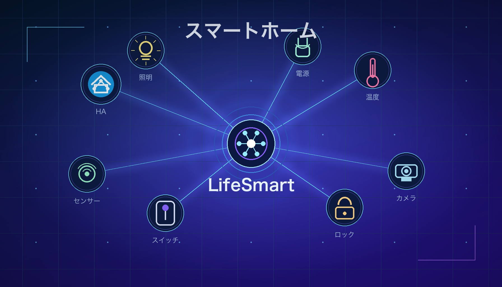
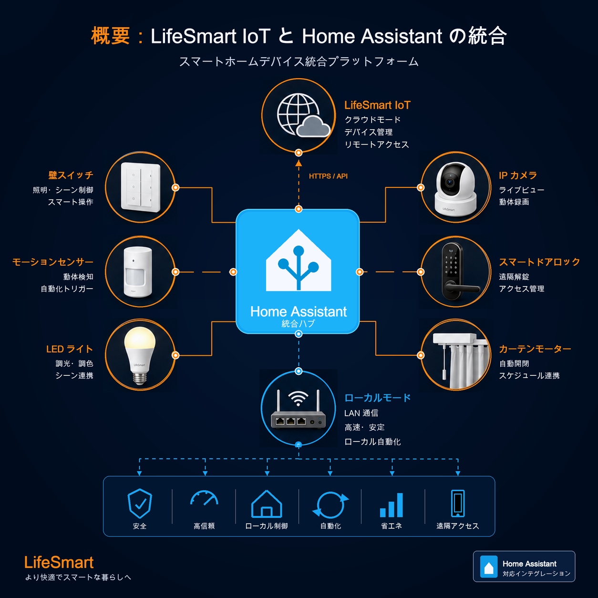
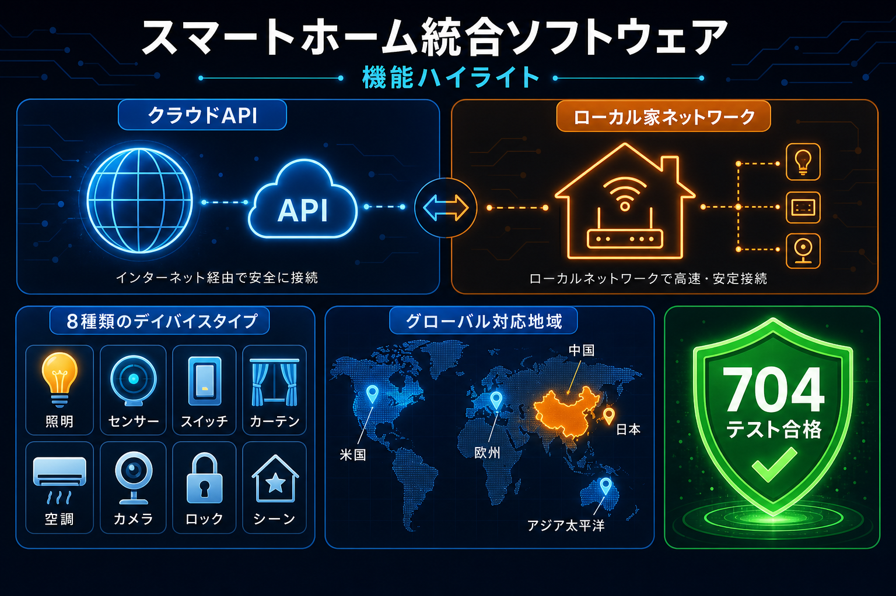
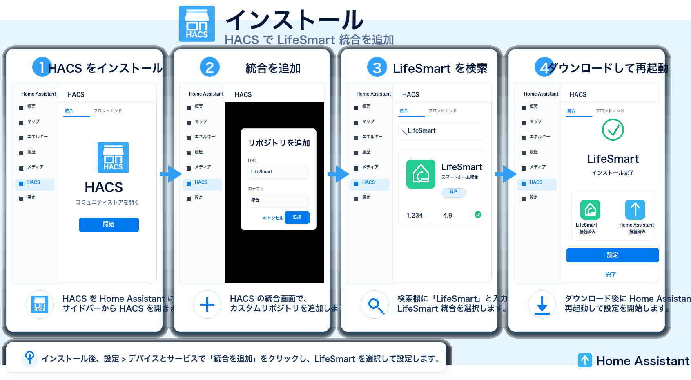
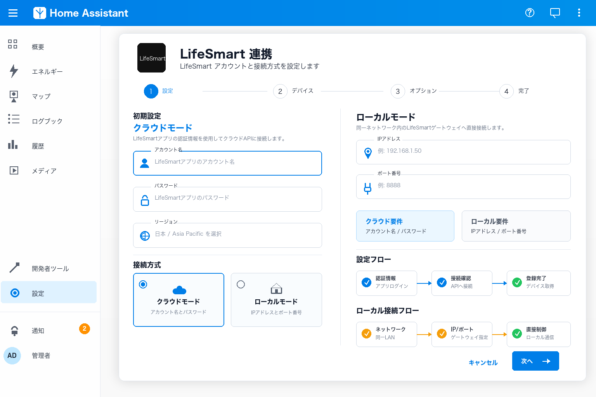
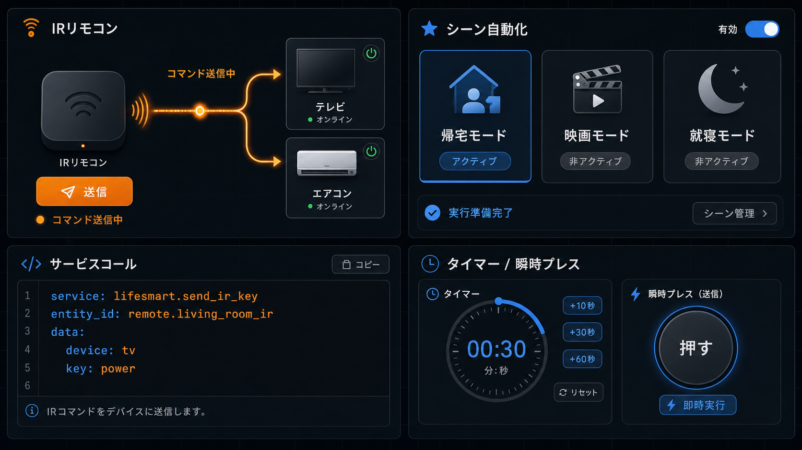
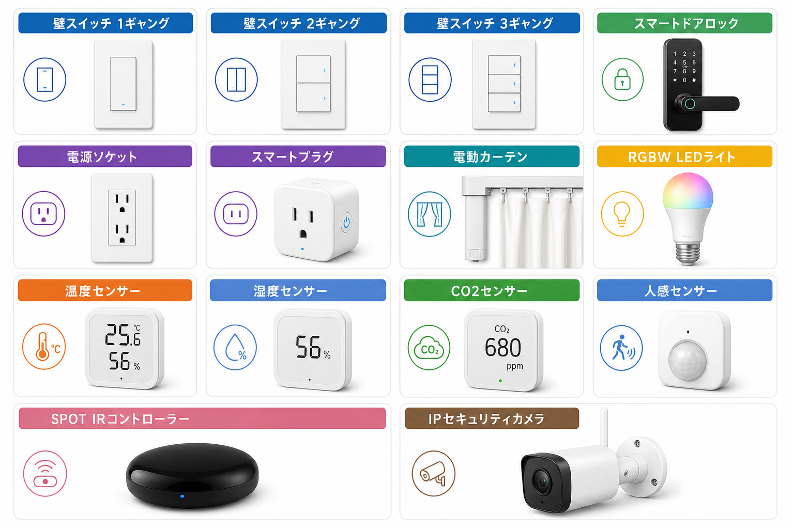
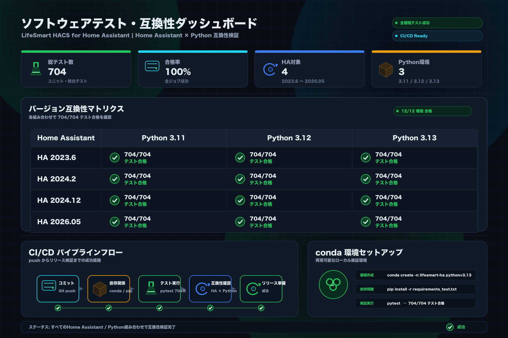
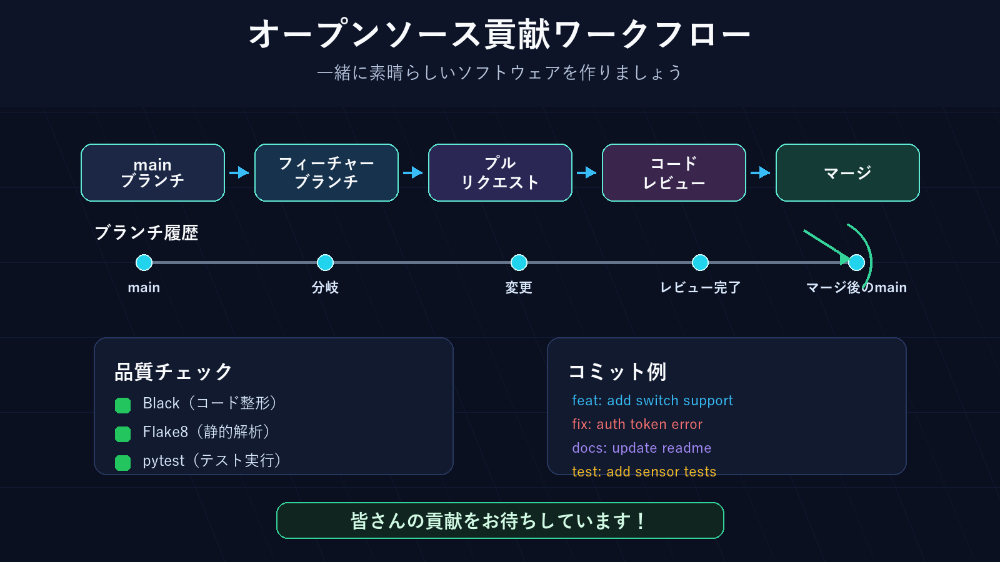

<sub>🌐 <a href="../README.md">English</a> · <a href="README.zh-CN.md">简体中文</a> · <b>日本語</b> · <a href="README.ko.md">한국어</a> · <a href="README.ru.md">Русский</a></sub>

<div align="center">

# LifeSmart IoT Home Assistant インテグレーション

[](https://github.com/hacs/integration)

[](https://github.com/MapleEve/lifesmart-for-homeassistant/releases/latest)
[](https://github.com/MapleEve/lifesmart-for-homeassistant/stargazers)
[](https://github.com/MapleEve/lifesmart-for-homeassistant/issues)


[](https://app.fossa.com/projects/git%2Bgithub.com%2FMapleEve%2Flifesmart-for-homeassistant?ref=badge_shield)

<br>
<br>



<br>

LifeSmart スマートホームデバイスをHome Assistantに接続。クラウドとローカルの2つの接続モード、<br>
自動デバイス検出、Home Assistantサービスによる高度なオートメーションをサポート。<br>
704以上の包括的なテストでHome Assistant 2023.6.3+をサポート。

<br>

[概要](#概要) · [機能](#機能) · [インストール](#インストール) · [初期設定](#初期設定) · [使い方](#使い方) · [対応デバイス](#対応デバイス) · [互換性](#互換性とテスト) · [コントリビューション](#開発とコントリビューション)

</div>

---

## 概要



LifeSmart for Home AssistantはLifeSmartスマートホームデバイスをHome Assistantにシームレスに統合します。クラウドとローカルの両モード、自動デバイス検出、Home Assistantサービスによる高度なオートメーションをサポートします。スイッチ、センサー、ロック、コントローラー、SPOTデバイス、カメラなど幅広いLifeSmartデバイスに対応しています。HACSによるインストールとアップデートが可能です。

---

## 機能



- **デュアル接続モード**: クラウドとローカルモード（LifeSmart APIまたはローカルHubを選択可能）
- **包括的なデバイスサポート**: スイッチ、センサー、ロック、コントローラー、ソケット、カーテンモーター、ライト、SPOT、カメラ
- **高度なサービス**: IRキー送信（エアコン含む）、LifeSmartシーンのトリガー、瞬時スイッチプレス
- **多地域サポート**: 中国、北米、欧州、日本、アジア太平洋、グローバル自動
- **バイリンガルUI**: 英語/中国語UIサポート
- **堅牢なテスト**: 704以上の包括的なテストで信頼性を保証
- **バージョン互換性**: Home Assistant 2023.6.3+に自動互換レイヤーで対応

### 最近の主な改善（2026年5月）

詳細なリリースノートは[CHANGELOG.md](../CHANGELOG.md)をご覧ください。

- **☁️ クラウド認証**: LifeSmart認証フローが返すリージョンを使用したパスワードログイン処理の改善
- **🏠 ローカルプロトコル堅牢性**: ネストされたパケットのローカルプロトコルデコードを強化
- **💡 デバイスフィードバック修正**: RGBWライト、SPOTステートマッピング、DOOYAカーテンの方向/位置更新
- **🔧 互換性レイヤー**: Home Assistant 2023.6.3から2026.05+の完全サポート
- **🧪 テスト強化**: 14の専用テストケースによる互換性テストの完全書き直し

---

## インストール



### HACSからのインストール

1. Home Assistantで**HACS > インテグレーション** > 「LifeSmart for Home Assistant」を検索します。
2. **インストール**をクリックします。
3. インストール後、**インテグレーションを追加**をクリックし「LifeSmart」を検索します。

[](https://my.home-assistant.io/redirect/hacs_repository/?owner=MapleEve&repository=lifesmart-for-homeassistant&category=integration)
[](https://my.home-assistant.io/redirect/config_flow_start?domain=lifesmart)

---

## 初期設定



### 前提条件

- **クラウドモード**: [LifeSmart Open Platform](http://www.ilifesmart.com/open/login)でApp KeyとApp Tokenを取得。LifeSmartアプリからユーザーIDを確認します。
- **ローカルモード**: HubのローカルIP、ポート（デフォルト8888）、ユーザー名（デフォルトadmin）、パスワード（デフォルトadmin）を確認します。

### 設定手順

#### クラウドモード

1. 接続方法として**クラウド**を選択します。
2. App Key、App Token、ユーザーID、リージョンを入力し、認証方法（トークンまたはパスワード）を選択します。
3. パスワード認証を使用する場合、Home AssistantがトークンをAI自動更新できるようLifeSmartアプリのパスワードを入力します。

#### ローカルモード

1. 接続方法として**ローカル**を選択します。
2. HubのIPアドレス、ポート（デフォルト8888）、ユーザー名（デフォルトadmin）、パスワード（デフォルトadmin）を入力します。

---

## 使い方



### Home Assistantサービス

- **IRキー送信**: リモートデバイス（テレビ、エアコンなど）にIRコマンドを送信します。
- **エアコンキー送信**: 電源、モード、温度、風量、スイングオプション付きでエアコンにIRコマンドを送信します。
- **シーントリガー**: HubとシーンIDを指定してLifeSmartシーンを有効化します。
- **スイッチプレス**: スイッチエンティティに指定時間の瞬時プレスを実行します。

サービスコール例（YAML）：

```yaml
service: lifesmart.send_ir_keys
data:
  agt: "_xXXXXXXXXXXXXXXXXX"
  me: "sl_spot_xxxxxxxx"
  ai: "AI_IR_xxxx_xxxxxxxx"
  category: "tv"
  brand: "custom"
  keys: ["power"]
```

---

## 対応デバイス



以下を含む幅広いLifeSmartデバイスをサポートします：

| カテゴリ | デバイス |
|---------|---------|
| **スイッチ** | SL_MC_ND1/2/3、SL_NATURE、SL_SW_IF1/2/3、SL_SW_ND1/2/3 など |
| **ロック** | SL_LK_LS、SL_LK_GTM、SL_LK_AG、SL_LK_SG、SL_LK_YL、SL_P_BDLK |
| **コントローラー** | SL_P、SL_JEMA |
| **ソケット/プラグ** | SL_OE_DE、SL_OE_3C、SL_OL_W、SL_OL_UK、SL_OL_UL |
| **カーテンモーター** | SL_SW_WIN、SL_CN_IF、SL_CN_FE、SL_DOOYA、SL_P_V2 |
| **ライト** | SL_LI_RGBW、SL_CT_RGBW、SL_SC_RGB、SL_LI_WW、SL_SPOT |
| **センサー** | SL_SC_G、SL_SC_THL、SL_SC_CM、SL_SC_BM、SL_SC_BE、ELIQ_EM |
| **SPOTデバイス** | MSL_IRCTL、OD_WE_IRCTL、SL_SPOT、SL_P_IR、SL_P_IR_V2 |
| **カメラ** | LSCAM:LSICAMGOS1、LSCAM:LSICAMEZ2 |

完全なリストは[const.py](https://github.com/MapleEve/lifesmart-for-homeassistant/blob/main/custom_components/lifesmart/const.py)をご覧ください。

---

## 互換性とテスト



### Home Assistantバージョンサポート

| 環境 | Python | Home Assistant | テスト結果 |
|-----|--------|----------------|----------|
| 環境 1 | 3.11.13 | **2023.6.0** | ✅ 704/704 |
| 環境 2 | 3.12.11 | **2024.2.0** | ✅ 704/704 |
| 環境 3 | 3.13.5 | **2024.12.0** | ✅ 704/704 |
| 現在 | 3.13.5 | **2026.05** | ✅ 704/704 |

### 互換性機能

- **自動バージョン検出**: 異なるHome Assistantおよびaiohttpバージョンにシームレスに適応
- **WebSocketタイムアウト処理**: レガシーfloatタイムアウトと最新ClientWSTimeoutオブジェクトの両方をサポート
- **気候エンティティ機能**: TURN_ON/TURN_OFF属性の後方互換性を提供
- **サービスコール互換性**: レガシーと最新のHome Assistantサービスコールコンストラクタの両方に対応

---

## 開発とコントリビューション



### 開発環境セットアップ

```bash
git clone https://github.com/MapleEve/lifesmart-HACS-for-hass.git
cd lifesmart-HACS-for-hass

python -m venv venv
source venv/bin/activate
pip install -r requirements.txt
pip install black flake8 pytest
```

### テスト

```bash
./.testing/test_ci_locally.sh        # インタラクティブなマルチ環境テスト
pytest custom_components/lifesmart/  # テスト実行
black custom_components/lifesmart/   # コードフォーマット
flake8 custom_components/lifesmart/  # リント
```

### コントリビューションガイドライン

- Blackフォーマット（88文字行長）に従う
- 新機能には包括的なテストを追加
- ユーザー向け変更のドキュメントを更新
- 慣習的なコミットメッセージを使用

詳細は[PRテンプレート](../.github/PULL_REQUEST_TEMPLATE.md)をご覧ください。

---

## ライセンス

[](https://app.fossa.com/projects/git%2Bgithub.com%2FMapleEve%2Flifesmart-for-homeassistant?ref=badge_large)
