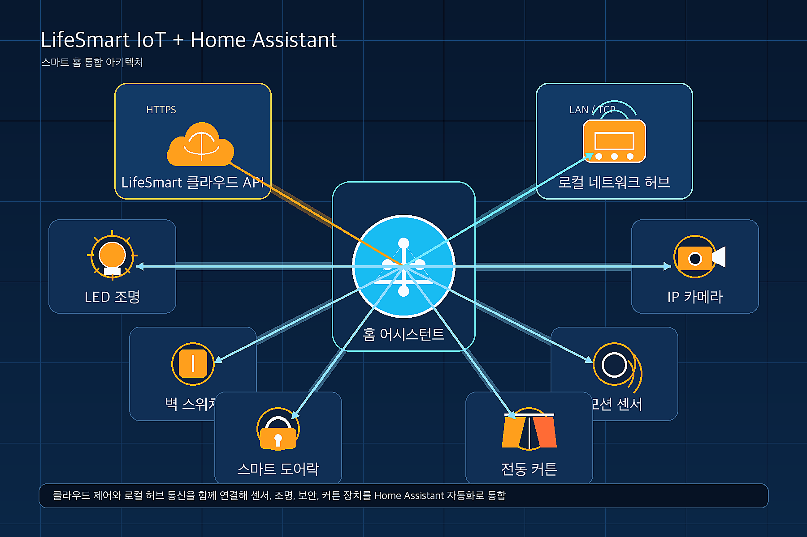
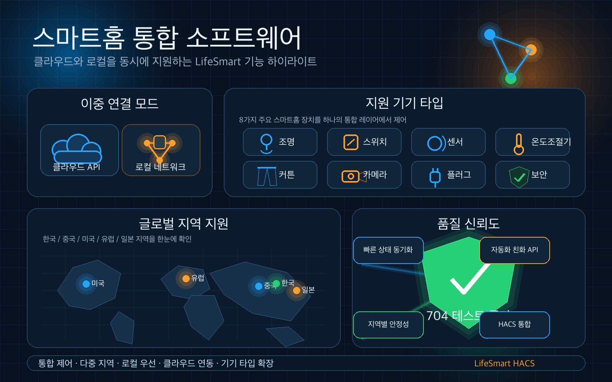
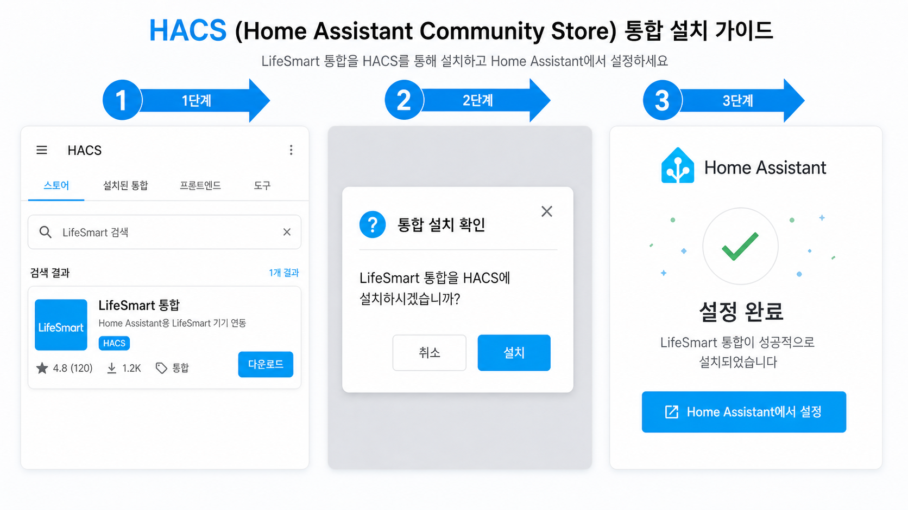
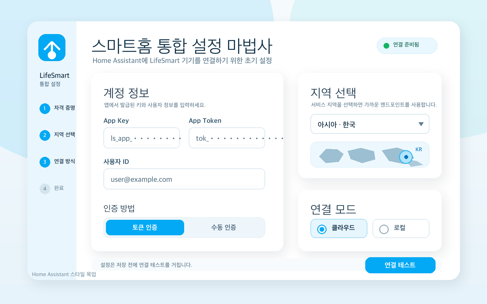
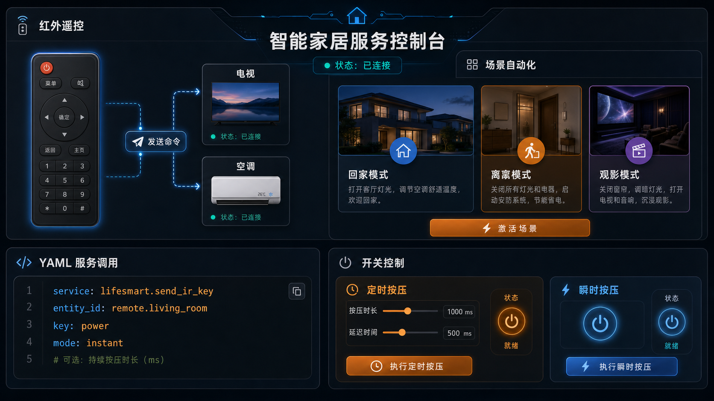
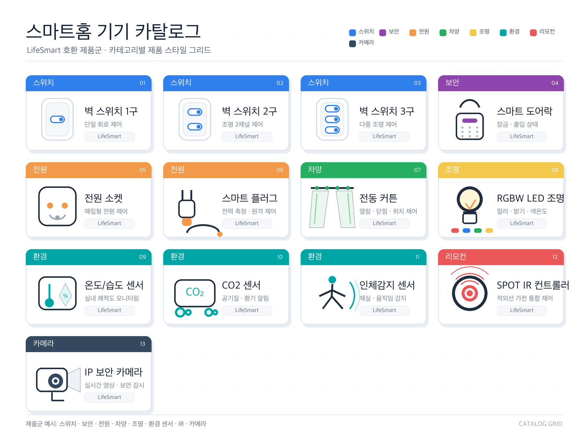
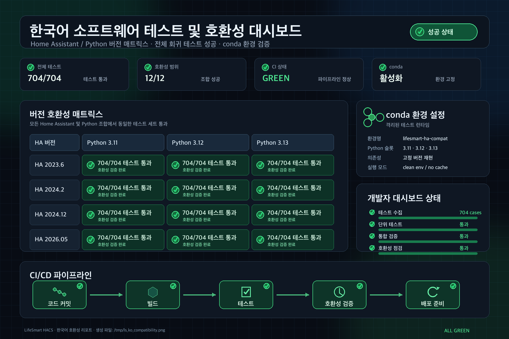
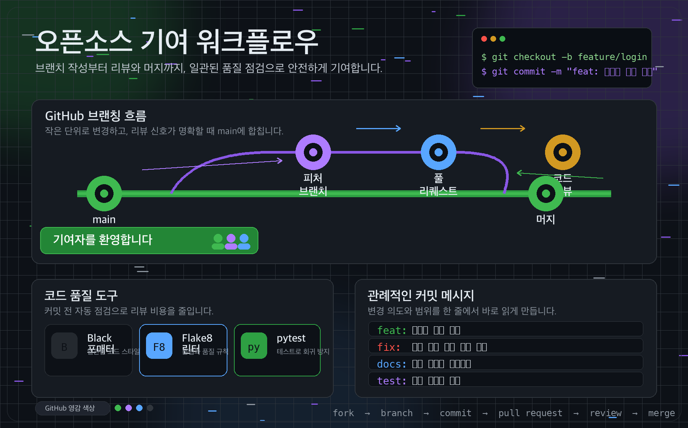

<sub>🌐 <a href="../README.md">English</a> · <a href="README.zh-CN.md">简体中文</a> · <a href="README.ja.md">日本語</a> · <b>한국어</b> · <a href="README.ru.md">Русский</a></sub>

<div align="center">

# LifeSmart IoT Home Assistant 통합

[](https://github.com/hacs/integration)

[](https://github.com/MapleEve/lifesmart-for-homeassistant/releases/latest)
[](https://github.com/MapleEve/lifesmart-for-homeassistant/stargazers)
[](https://github.com/MapleEve/lifesmart-for-homeassistant/issues)


[](https://app.fossa.com/projects/git%2Bgithub.com%2FMapleEve%2Flifesmart-for-homeassistant?ref=badge_shield)

<br>
<br>



<br>

LifeSmart 스마트홈 기기를 Home Assistant에 연결합니다. 클라우드와 로컬 두 가지 연결 모드,<br>
자동 기기 검색, Home Assistant 서비스를 통한 고급 자동화를 지원합니다.<br>
704개 이상의 테스트로 Home Assistant 2023.6.3+를 지원합니다.

<br>

[개요](#개요) · [기능](#기능) · [설치](#설치) · [초기 설정](#초기-설정) · [사용 방법](#사용-방법) · [지원 기기](#지원-기기) · [호환성](#호환성-및-테스트) · [기여](#개발-및-기여)

</div>

---

## 개요


LifeSmart for Home Assistant는 LifeSmart 스마트홈 기기를 Home Assistant와 원활하게 통합합니다. 클라우드와 로컬 두 가지 모드, 자동 기기 검색, Home Assistant 서비스를 통한 고급 자동화를 지원합니다. 스위치, 센서, 잠금장치, 컨트롤러, SPOT 기기, 카메라 등 다양한 LifeSmart 기기를 지원합니다. HACS를 통해 설치 및 업데이트할 수 있습니다.

---

## 기능



- **이중 연결 모드**: 클라우드 및 로컬 모드 (LifeSmart API 또는 로컬 허브 선택 가능)
- **포괄적인 기기 지원**: 스위치, 센서, 잠금장치, 컨트롤러, 소켓, 커튼 모터, 조명, SPOT, 카메라
- **고급 서비스**: IR 키 전송(에어컨 포함), LifeSmart 장면 트리거, 순간 스위치 누름
- **다지역 지원**: 중국, 북미, 유럽, 일본, 아시아태평양, 전역 자동
- **이중 언어 인터페이스**: 영어/중국어 UI 지원
- **강력한 테스트**: 704개 이상의 포괄적인 테스트로 신뢰성 보장
- **버전 호환성**: Home Assistant 2023.6.3+ 자동 호환 레이어

### 최근 주요 개선사항 (2026년 5월)

자세한 릴리스 노트는 [CHANGELOG.md](../CHANGELOG.md)를 참조하세요.

- **☁️ 클라우드 인증**: LifeSmart 인증 흐름이 반환하는 지역을 사용한 비밀번호 로그인 처리 개선
- **🏠 로컬 프로토콜 강화**: 중첩된 패킷의 로컬 프로토콜 디코딩 강화
- **💡 기기 피드백 수정**: RGBW 조명, SPOT 상태 매핑, DOOYA 커튼 방향/위치 업데이트
- **🔧 호환성 레이어**: Home Assistant 2023.6.3~2026.05+ 완전 지원
- **🧪 테스트 강화**: 14개의 전용 테스트 케이스로 호환성 테스트 완전 재작성

---

## 설치



### HACS를 통한 설치

1. Home Assistant에서 **HACS > 통합** > "LifeSmart for Home Assistant"를 검색합니다.
2. **설치**를 클릭합니다.
3. 설치 후 **통합 추가**를 클릭하고 "LifeSmart"를 검색합니다.

[](https://my.home-assistant.io/redirect/hacs_repository/?owner=MapleEve&repository=lifesmart-for-homeassistant&category=integration)
[](https://my.home-assistant.io/redirect/config_flow_start?domain=lifesmart)

---

## 초기 설정



### 사전 요구사항

- **클라우드 모드**: [LifeSmart 오픈 플랫폼](http://www.ilifesmart.com/open/login)에서 App Key와 App Token을 획득합니다. LifeSmart 앱에서 사용자 ID를 확인합니다.
- **로컬 모드**: 허브의 로컬 IP, 포트(기본값 8888), 사용자 이름(기본값 admin), 비밀번호(기본값 admin)를 확인합니다.

### 설정 단계

#### 클라우드 모드

1. 연결 방법으로 **클라우드**를 선택합니다.
2. App Key, App Token, 사용자 ID를 입력하고, 지역을 선택하며, 인증 방법(토큰 또는 비밀번호)을 선택합니다.
3. 비밀번호 인증을 사용하는 경우 LifeSmart 앱 비밀번호를 입력하여 Home Assistant가 토큰을 자동으로 갱신할 수 있게 합니다.

#### 로컬 모드

1. 연결 방법으로 **로컬**을 선택합니다.
2. 허브의 IP 주소, 포트(기본값 8888), 사용자 이름(기본값 admin), 비밀번호(기본값 admin)를 입력합니다.

---

## 사용 방법



### Home Assistant 서비스

- **IR 키 전송**: 원격 기기(예: TV, 에어컨)에 IR 명령을 전송합니다.
- **에어컨 키 전송**: 전원, 모드, 온도, 풍량, 스윙 옵션과 함께 에어컨에 IR 명령을 전송합니다.
- **장면 트리거**: 허브와 장면 ID를 지정하여 LifeSmart 장면을 활성화합니다.
- **스위치 누름**: 지정된 시간 동안 스위치 엔티티를 순간적으로 누릅니다.

서비스 호출 예시 (YAML):

```yaml
service: lifesmart.send_ir_keys
data:
  agt: "_xXXXXXXXXXXXXXXXXX"
  me: "sl_spot_xxxxxxxx"
  ai: "AI_IR_xxxx_xxxxxxxx"
  category: "tv"
  brand: "custom"
  keys: ["power"]
```

---

## 지원 기기



다음을 포함한 다양한 LifeSmart 기기를 지원합니다:

| 카테고리 | 기기 |
|---------|------|
| **스위치** | SL_MC_ND1/2/3, SL_NATURE, SL_SW_IF1/2/3, SL_SW_ND1/2/3 등 |
| **잠금장치** | SL_LK_LS, SL_LK_GTM, SL_LK_AG, SL_LK_SG, SL_LK_YL, SL_P_BDLK |
| **컨트롤러** | SL_P, SL_JEMA |
| **소켓/플러그** | SL_OE_DE, SL_OE_3C, SL_OL_W, SL_OL_UK, SL_OL_UL |
| **커튼 모터** | SL_SW_WIN, SL_CN_IF, SL_CN_FE, SL_DOOYA, SL_P_V2 |
| **조명** | SL_LI_RGBW, SL_CT_RGBW, SL_SC_RGB, SL_LI_WW, SL_SPOT |
| **센서** | SL_SC_G, SL_SC_THL, SL_SC_CM, SL_SC_BM, SL_SC_BE, ELIQ_EM |
| **SPOT 기기** | MSL_IRCTL, OD_WE_IRCTL, SL_SPOT, SL_P_IR, SL_P_IR_V2 |
| **카메라** | LSCAM:LSICAMGOS1, LSCAM:LSICAMEZ2 |

전체 목록은 [const.py](https://github.com/MapleEve/lifesmart-for-homeassistant/blob/main/custom_components/lifesmart/const.py)를 참조하세요.

---

## 호환성 및 테스트



### Home Assistant 버전 지원

| 환경 | Python | Home Assistant | 테스트 결과 |
|-----|--------|----------------|-----------|
| 환경 1 | 3.11.13 | **2023.6.0** | ✅ 704/704 |
| 환경 2 | 3.12.11 | **2024.2.0** | ✅ 704/704 |
| 환경 3 | 3.13.5 | **2024.12.0** | ✅ 704/704 |
| 현재 | 3.13.5 | **2026.05** | ✅ 704/704 |

### 호환성 기능

- **자동 버전 감지**: 다양한 Home Assistant 및 aiohttp 버전에 원활하게 적응
- **WebSocket 타임아웃 처리**: 레거시 float 타임아웃과 현대적인 ClientWSTimeout 객체 모두 지원
- **기후 엔티티 기능**: TURN_ON/TURN_OFF 속성에 대한 하위 호환성 제공
- **서비스 호출 호환성**: 레거시와 현대적인 Home Assistant 서비스 호출 생성자 모두 처리

---

## 개발 및 기여



### 개발 환경 설정

```bash
git clone https://github.com/MapleEve/lifesmart-HACS-for-hass.git
cd lifesmart-HACS-for-hass

python -m venv venv
source venv/bin/activate
pip install -r requirements.txt
pip install black flake8 pytest
```

### 테스트

```bash
./.testing/test_ci_locally.sh        # 대화형 멀티 환경 테스트
pytest custom_components/lifesmart/  # 테스트 실행
black custom_components/lifesmart/   # 코드 포맷
flake8 custom_components/lifesmart/  # 린트
```

### 기여 가이드라인

- Black 포맷팅 준수 (88자 줄 길이)
- 새 기능에 포괄적인 테스트 추가
- 사용자 대면 변경사항의 문서 업데이트
- 관례적인 커밋 메시지 사용

자세한 내용은 [PR 템플릿](../.github/PULL_REQUEST_TEMPLATE.md)을 참조하세요.

---

## 라이선스

[](https://app.fossa.com/projects/git%2Bgithub.com%2FMapleEve%2Flifesmart-for-homeassistant?ref=badge_large)
