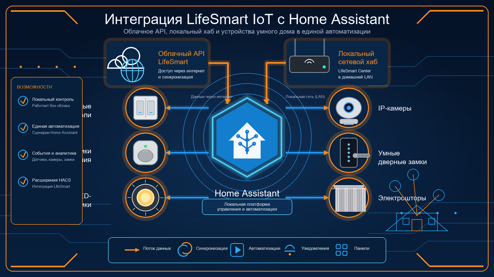
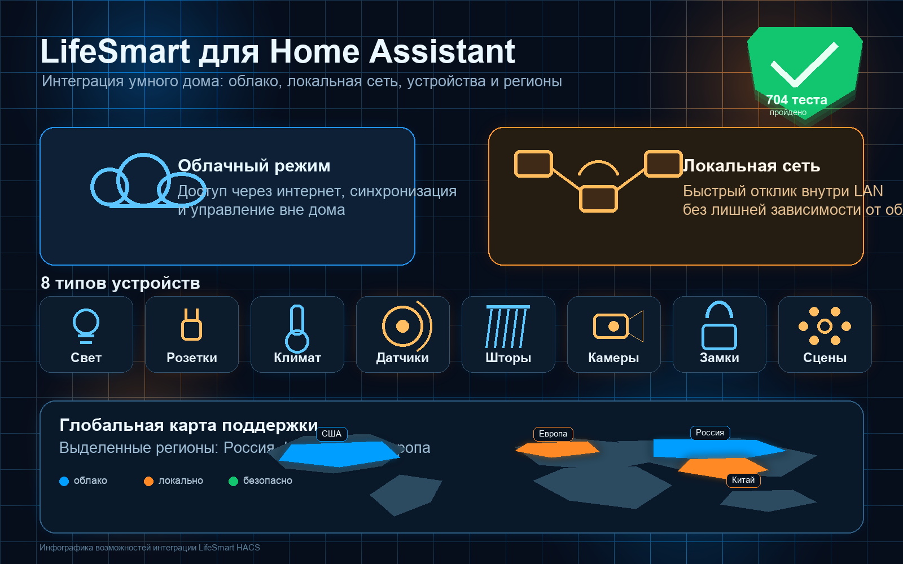
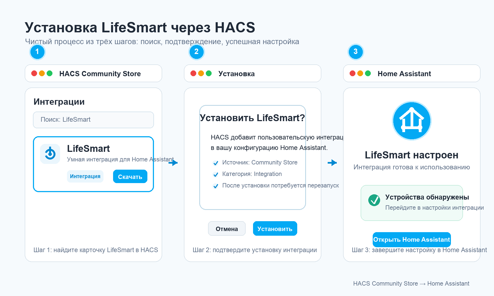
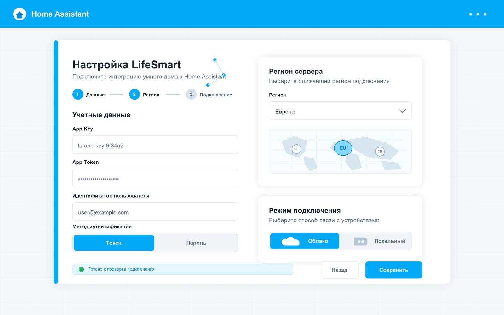
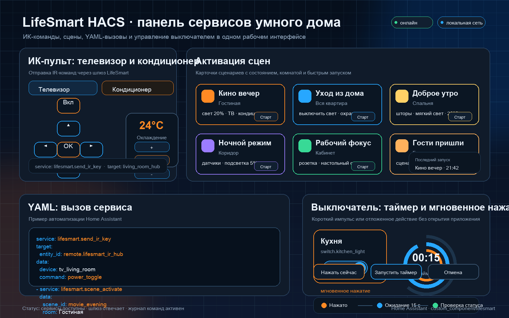
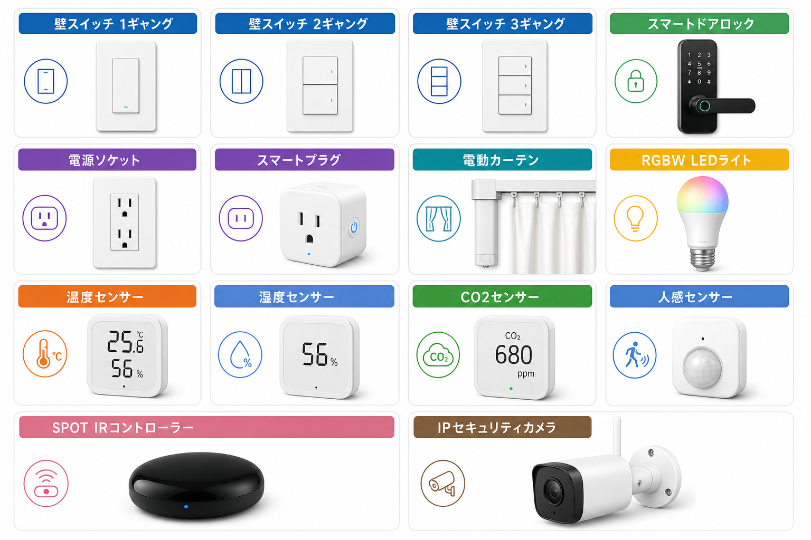
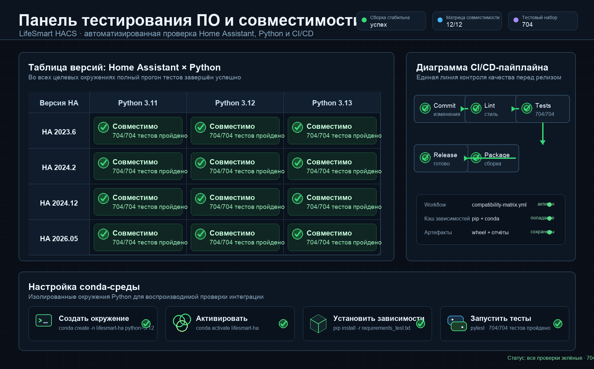
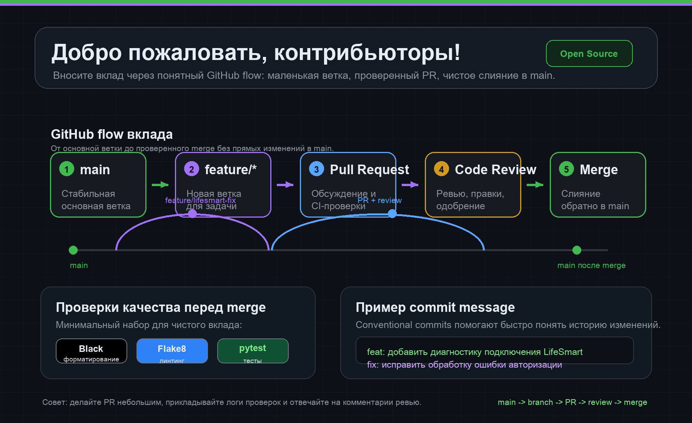

<sub>🌐 <a href="../README.md">English</a> · <a href="README.zh-CN.md">简体中文</a> · <a href="README.ja.md">日本語</a> · <a href="README.ko.md">한국어</a> · <b>Русский</b></sub>

<div align="center">

# LifeSmart IoT Интеграция для Home Assistant

[](https://github.com/hacs/integration)

[](https://github.com/MapleEve/lifesmart-for-homeassistant/releases/latest)
[](https://github.com/MapleEve/lifesmart-for-homeassistant/stargazers)
[](https://github.com/MapleEve/lifesmart-for-homeassistant/issues)


[](https://app.fossa.com/projects/git%2Bgithub.com%2FMapleEve%2Flifesmart-for-homeassistant?ref=badge_shield)

<br>
<br>



<br>

Подключите устройства LifeSmart Smart Home к Home Assistant с режимами облачного и локального подключения,<br>
автоматическим обнаружением устройств и расширенной автоматизацией через сервисы Home Assistant.<br>
Поддерживается более 704 комплексных тестов для Home Assistant 2023.6.3+.

<br>

[Обзор](#обзор) · [Функции](#функции) · [Установка](#установка) · [Инициализация](#инициализация) · [Использование](#использование) · [Устройства](#поддерживаемые-устройства) · [Совместимость](#совместимость-и-тестирование) · [Участие](#разработка-и-вклад)

</div>

---

## Обзор


LifeSmart для Home Assistant интегрирует устройства LifeSmart Smart Home с Home Assistant. Поддерживаются как облачный, так и локальный режимы работы, автоматическое обнаружение устройств и расширенная автоматизация через сервисы Home Assistant. Интеграция поддерживает широкий спектр устройств LifeSmart, включая выключатели, датчики, замки, контроллеры, устройства SPOT и камеры. Установка и обновление доступны через HACS.

---

## Функции



- **Двойной режим подключения**: Облачный и локальный режимы (выбор между LifeSmart API или локальным хабом)
- **Комплексная поддержка устройств**: Выключатели, датчики, замки, контроллеры, розетки, двигатели штор, светильники, SPOT, камеры
- **Расширенные сервисы**: Отправка ИК-команд (включая кондиционеры), запуск сцен LifeSmart, мгновенное нажатие выключателя
- **Поддержка нескольких регионов**: Китай, Северная Америка, Европа, Япония, Азиатско-Тихоокеанский регион, Глобальный авто
- **Двуязычный интерфейс**: Поддержка UI на английском/китайском языках
- **Надёжное тестирование**: 704+ комплексных тестов для обеспечения надёжности
- **Совместимость версий**: Home Assistant 2023.6.3+ с автоматическими уровнями совместимости

### Последние значительные улучшения (Май 2026)

Подробные примечания к выпуску см. в [CHANGELOG.md](../CHANGELOG.md).

- **☁️ Облачная аутентификация**: Улучшена обработка входа по паролю с использованием региона из потока аутентификации LifeSmart
- **🏠 Надёжность локального протокола**: Усилено декодирование вложенных пакетов локального протокола
- **💡 Исправления обратной связи устройств**: RGBW-светильники, отображение состояния SPOT, обновления направления/положения штор DOOYA
- **🔧 Уровень совместимости**: Полная поддержка Home Assistant 2023.6.3 — 2026.05+
- **🧪 Расширенное тестирование**: Полностью переписанные тесты совместимости с 14 специализированными тестовыми случаями

---

## Установка



### Установка через HACS

1. В Home Assistant перейдите в **HACS > Интеграции** > Найдите «LifeSmart for Home Assistant».
2. Нажмите **Установить**.
3. После установки нажмите **Добавить интеграцию** и найдите «LifeSmart».

[](https://my.home-assistant.io/redirect/hacs_repository/?owner=MapleEve&repository=lifesmart-for-homeassistant&category=integration)
[](https://my.home-assistant.io/redirect/config_flow_start?domain=lifesmart)

---

## Инициализация



### Предварительные требования

- **Облачный режим**: Зарегистрируйтесь на [LifeSmart Open Platform](http://www.ilifesmart.com/open/login) для получения App Key и App Token. Войдите в мобильное приложение LifeSmart для получения User ID.
- **Локальный режим**: Получите локальный IP-адрес хаба, порт (по умолчанию 8888), имя пользователя (по умолчанию admin) и пароль (по умолчанию admin).

### Шаги настройки

#### Облачный режим

1. Выберите **Облако** как метод подключения.
2. Введите App Key, App Token, User ID, выберите регион и метод аутентификации (токен или пароль).
3. При использовании аутентификации по паролю введите пароль приложения LifeSmart, чтобы Home Assistant мог автоматически обновлять токен.

#### Локальный режим

1. Выберите **Локальный** как метод подключения.
2. Введите IP-адрес хаба, порт (по умолчанию 8888), имя пользователя (по умолчанию admin) и пароль (по умолчанию admin).

---

## Использование



### Сервисы Home Assistant

- **Отправка ИК-команд**: Отправка ИК-команд на пульты дистанционного управления (телевизоры, кондиционеры).
- **Отправка команд кондиционера**: Отправка ИК-команд с параметрами питания, режима, температуры, скорости вентилятора и качания.
- **Запуск сцены**: Активация сцены LifeSmart по указанию хаба и идентификатора сцены.
- **Нажатие выключателя**: Выполнение мгновенного нажатия на выключатель с указанной длительностью.

Пример вызова сервиса (YAML):

```yaml
service: lifesmart.send_ir_keys
data:
  agt: "_xXXXXXXXXXXXXXXXXX"
  me: "sl_spot_xxxxxxxx"
  ai: "AI_IR_xxxx_xxxxxxxx"
  category: "tv"
  brand: "custom"
  keys: ["power"]
```

---

## Поддерживаемые устройства



Поддерживает широкий спектр устройств LifeSmart, включая, но не ограничиваясь:

| Категория | Устройства |
|-----------|-----------|
| **Выключатели** | SL_MC_ND1/2/3, SL_NATURE, SL_SW_IF1/2/3, SL_SW_ND1/2/3 и др. |
| **Замки** | SL_LK_LS, SL_LK_GTM, SL_LK_AG, SL_LK_SG, SL_LK_YL, SL_P_BDLK |
| **Контроллеры** | SL_P, SL_JEMA |
| **Розетки/Вилки** | SL_OE_DE, SL_OE_3C, SL_OL_W, SL_OL_UK, SL_OL_UL |
| **Двигатели штор** | SL_SW_WIN, SL_CN_IF, SL_CN_FE, SL_DOOYA, SL_P_V2 |
| **Светильники** | SL_LI_RGBW, SL_CT_RGBW, SL_SC_RGB, SL_LI_WW, SL_SPOT |
| **Датчики** | SL_SC_G, SL_SC_THL, SL_SC_CM, SL_SC_BM, SL_SC_BE, ELIQ_EM |
| **Устройства SPOT** | MSL_IRCTL, OD_WE_IRCTL, SL_SPOT, SL_P_IR, SL_P_IR_V2 |
| **Камеры** | LSCAM:LSICAMGOS1, LSCAM:LSICAMEZ2 |

Полный список см. в [const.py](https://github.com/MapleEve/lifesmart-for-homeassistant/blob/main/custom_components/lifesmart/const.py).

---

## Совместимость и тестирование



### Поддержка версий Home Assistant

| Среда | Python | Home Assistant | Результат тестов |
|-------|--------|----------------|-----------------|
| Среда 1 | 3.11.13 | **2023.6.0** | ✅ 704/704 |
| Среда 2 | 3.12.11 | **2024.2.0** | ✅ 704/704 |
| Среда 3 | 3.13.5 | **2024.12.0** | ✅ 704/704 |
| Текущая | 3.13.5 | **2026.05** | ✅ 704/704 |

### Функции совместимости

- **Автоматическое определение версии**: Адаптируется к различным версиям Home Assistant и aiohttp
- **Обработка тайм-аута WebSocket**: Поддержка устаревших float-тайм-аутов и современных объектов ClientWSTimeout
- **Функции климатической сущности**: Обратная совместимость для атрибутов TURN_ON/TURN_OFF
- **Совместимость вызовов сервисов**: Обработка как устаревших, так и современных конструкторов вызовов сервисов HA

---

## Разработка и вклад



### Настройка среды разработки

```bash
git clone https://github.com/MapleEve/lifesmart-HACS-for-hass.git
cd lifesmart-HACS-for-hass

python -m venv venv
source venv/bin/activate
pip install -r requirements.txt
pip install black flake8 pytest
```

### Тестирование

```bash
./.testing/test_ci_locally.sh        # Интерактивное тестирование в нескольких средах
pytest custom_components/lifesmart/  # Запуск тестов
black custom_components/lifesmart/   # Форматирование кода
flake8 custom_components/lifesmart/  # Линтинг
```

### Руководство по вкладу

- Следовать форматированию Black (длина строки 88 символов)
- Добавлять комплексные тесты для новых функций
- Обновлять документацию для изменений, видимых пользователям
- Использовать стандартные сообщения коммитов

Подробности см. в [шаблоне PR](../.github/PULL_REQUEST_TEMPLATE.md).

---

## Лицензия

[](https://app.fossa.com/projects/git%2Bgithub.com%2FMapleEve%2Flifesmart-for-homeassistant?ref=badge_large)
