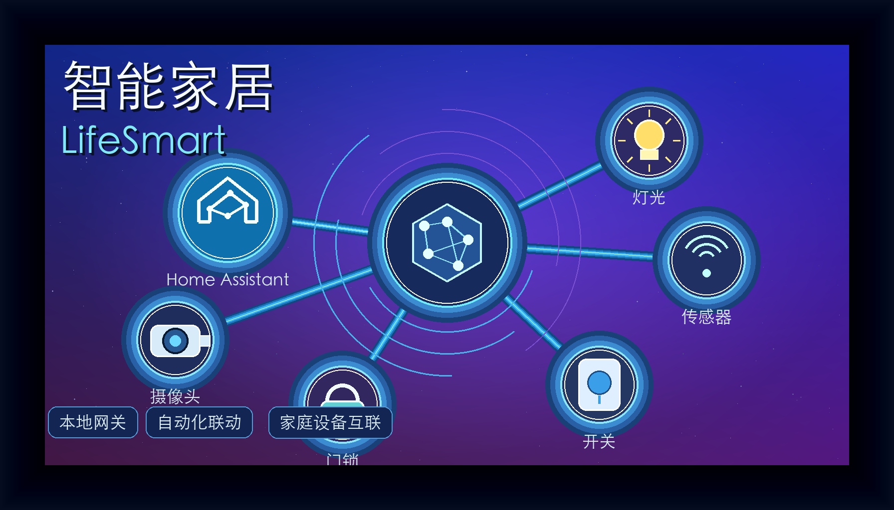
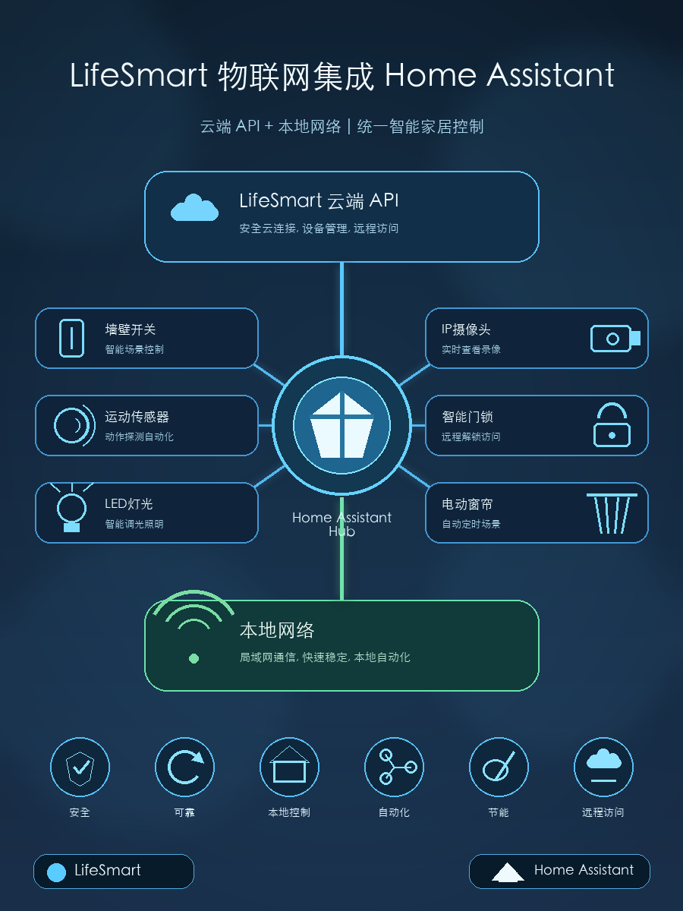
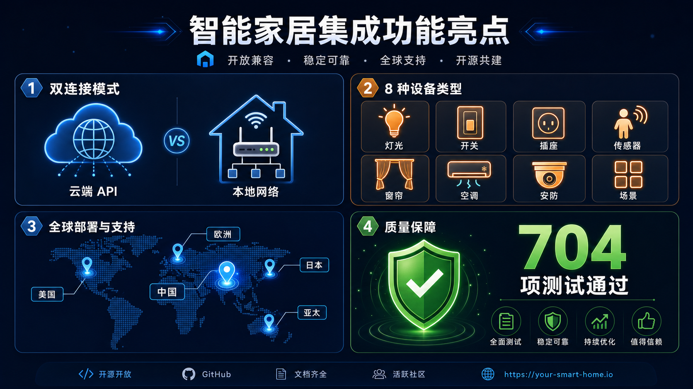
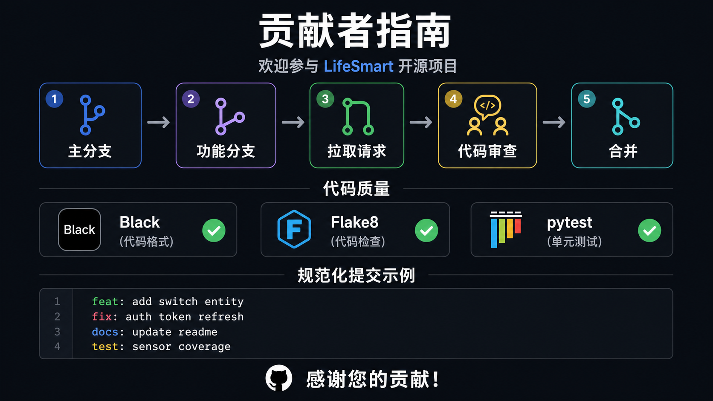
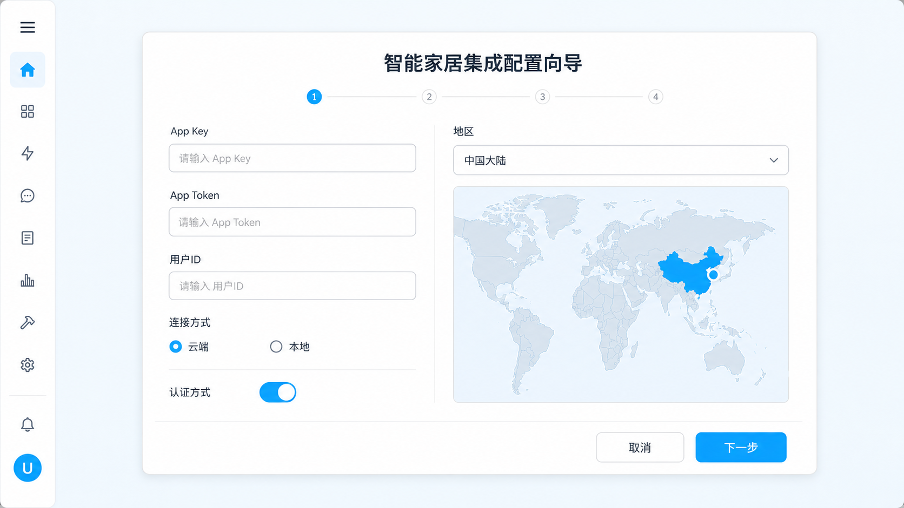
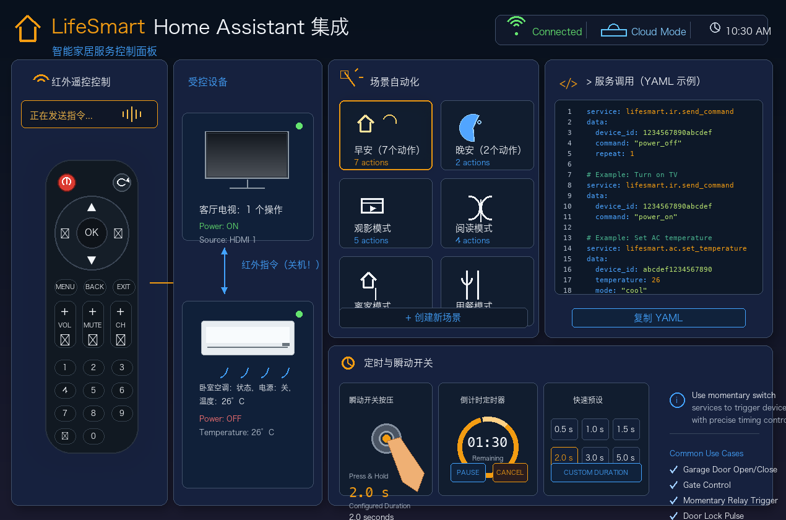
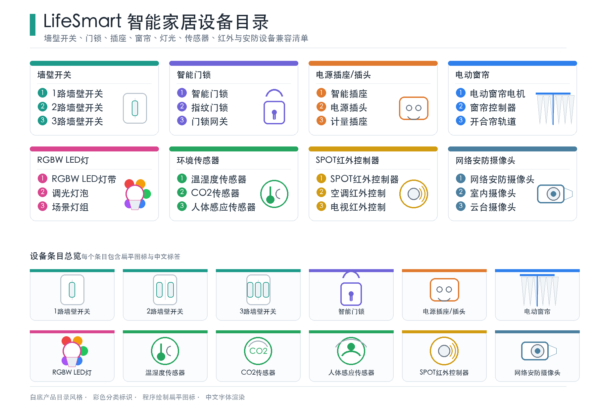
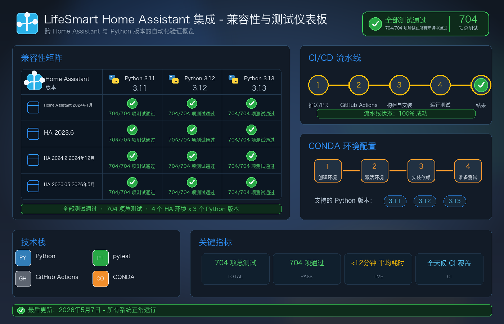
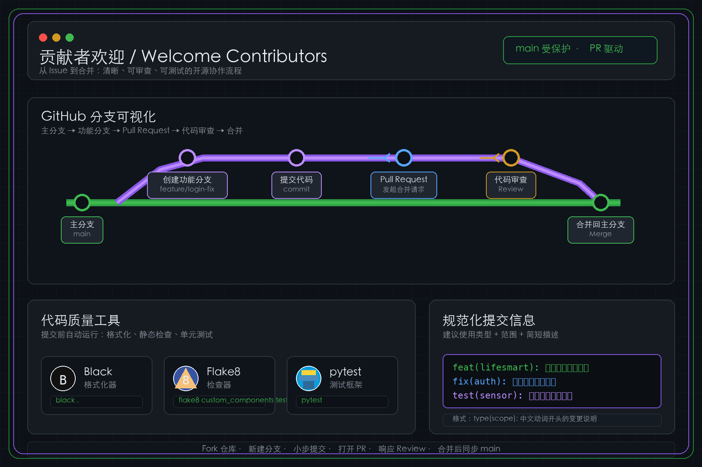

<sub>🌐 <a href="../README.md">English</a> · <b>简体中文</b> · <a href="README.ja.md">日本語</a> · <a href="README.ko.md">한국어</a> · <a href="README.ru.md">Русский</a></sub>

<div align="center">

# LifeSmart 智能家居 Home Assistant 集成

[](https://github.com/hacs/integration)

[](https://github.com/MapleEve/lifesmart-for-homeassistant/releases/latest)
[](https://github.com/MapleEve/lifesmart-for-homeassistant/stargazers)
[](https://github.com/MapleEve/lifesmart-for-homeassistant/issues)


[](https://app.fossa.com/projects/git%2Bgithub.com%2FMapleEve%2Flifesmart-for-homeassistant?ref=badge_shield)

<br>
<br>



<br>

将 LifeSmart 智能家居设备连接到 Home Assistant，支持云端与本地两种连接模式，<br>
自动设备发现，以及通过 Home Assistant 服务实现高级自动化控制。<br>
经过 704+ 次全面测试，支持 Home Assistant 2023.6.3+。

<br>

[概述](#概述) · [功能特性](#功能特性) · [安装方法](#安装方法) · [初始化配置](#初始化配置) · [使用说明](#使用说明) · [支持的设备](#支持的设备) · [兼容性与测试](#兼容性与测试) · [开发与贡献](#开发与贡献)

</div>

---

## 概述



LifeSmart for Home Assistant 将 LifeSmart 智能家居设备与 Home Assistant 无缝集成。支持云端和本地两种连接模式、自动设备发现，以及通过 Home Assistant 服务实现高级自动化。集成支持广泛的 LifeSmart 设备，包括开关、传感器、门锁、控制器、SPOT 设备和摄像头。可通过 HACS 进行安装和更新。

---

## 功能特性



- **双重连接模式**：云端和本地模式（选择 LifeSmart API 或本地 Hub）
- **全面设备支持**：开关、传感器、门锁、控制器、插座、窗帘电机、灯光、SPOT、摄像头
- **高级服务**：发送红外键码（含空调）、触发 LifeSmart 场景、瞬时开关按压
- **多区域支持**：中国大陆、北美、欧洲、日本、亚太、全球自动
- **双语界面**：支持中英文 UI
- **可靠测试**：704+ 次全面测试保障稳定性
- **版本兼容**：Home Assistant 2023.6.3+ 自动兼容层

### 近期重要改进（2026 年 5 月）

详细更新日志请参见 [CHANGELOG.md](../CHANGELOG.md)。

- **☁️ 云端认证**：改进密码登录处理，使用 LifeSmart 认证流程返回的区域信息
- **🏠 本地协议强化**：强化嵌套数据包的本地协议解码
- **💡 设备反馈修复**：RGBW 灯光、SPOT 状态映射、DOOYA 窗帘方向/位置更新
- **🔧 兼容性层**：完整支持 Home Assistant 2023.6.3 至 2026.05+
- **🧪 增强测试**：完全重写兼容性测试，包含 14 个专项测试用例
- **🏗️ 代码架构**：统一客户端接口，分离本地/OAPI 客户端 ([#66](https://github.com/MapleEve/lifesmart-HACS-for-hass/pull/66))

---

## 安装方法



### 通过 HACS 安装

1. 在 Home Assistant 中，前往 **HACS > 集成** > 搜索"LifeSmart for Home Assistant"。
2. 点击**安装**。
3. 安装完成后，点击**添加集成**并搜索"LifeSmart"。

[](https://my.home-assistant.io/redirect/hacs_repository/?owner=MapleEve&repository=lifesmart-for-homeassistant&category=integration)
[](https://my.home-assistant.io/redirect/config_flow_start?domain=lifesmart)

---

## 初始化配置



### 前提条件

- **云端模式**：在 [LifeSmart 开放平台](http://www.ilifesmart.com/open/login) 注册新应用以获取 App Key 和 App Token，并通过 LifeSmart 手机 App 获取用户 ID。
- **本地模式**：获取 LifeSmart Hub 的本地 IP 地址、端口（默认 8888）、用户名（默认 admin）和密码（默认 admin）。

### 配置步骤

#### 云端模式

1. 选择**云端**作为连接方式。
2. 输入 App Key、App Token、用户 ID，选择区域，选择认证方式（令牌或密码）。
3. 如使用密码认证，输入 LifeSmart App 密码以允许 Home Assistant 自动刷新令牌。

#### 本地模式

1. 选择**本地**作为连接方式。
2. 输入 Hub 的 IP 地址、端口（默认 8888）、用户名（默认 admin）和密码（默认 admin）。

---

## 使用说明



### Home Assistant 服务

- **发送红外键码**：向遥控设备（如电视、空调）发送红外指令。
- **发送空调键码**：向空调发送带电源、模式、温度、风速、摆风选项的红外指令。
- **触发场景**：通过指定 Hub 和场景 ID 激活 LifeSmart 场景。
- **按压开关**：对开关实体执行指定时长的瞬时按压操作。

服务调用示例（YAML）：

```yaml
service: lifesmart.send_ir_keys
data:
  agt: "_xXXXXXXXXXXXXXXXXX"
  me: "sl_spot_xxxxxxxx"
  ai: "AI_IR_xxxx_xxxxxxxx"
  category: "tv"
  brand: "custom"
  keys: ["power"]
```

---

## 支持的设备



支持多种 LifeSmart 设备，包括但不限于：

| 类别 | 设备型号 |
|------|---------|
| **开关** | SL_MC_ND1/2/3、SL_NATURE、SL_SW_IF1/2/3、SL_SW_ND1/2/3、SL_SW_NS1/2/3 等 |
| **门锁** | SL_LK_LS、SL_LK_GTM、SL_LK_AG、SL_LK_SG、SL_LK_YL、SL_P_BDLK |
| **控制器** | SL_P、SL_JEMA |
| **插座/插头** | SL_OE_DE、SL_OE_3C、SL_OL_W、SL_OL_UK、SL_OL_UL |
| **窗帘电机** | SL_SW_WIN、SL_CN_IF、SL_CN_FE、SL_DOOYA、SL_P_V2 |
| **灯光** | SL_LI_RGBW、SL_CT_RGBW、SL_SC_RGB、SL_LI_WW、SL_SPOT |
| **传感器** | SL_SC_G、SL_SC_THL、SL_SC_CM、SL_SC_BM、SL_SC_BE、ELIQ_EM |
| **SPOT 设备** | MSL_IRCTL、OD_WE_IRCTL、SL_SPOT、SL_P_IR、SL_P_IR_V2 |
| **摄像头** | LSCAM:LSICAMGOS1、LSCAM:LSICAMEZ2 |

完整设备列表请参见 [const.py](https://github.com/MapleEve/lifesmart-for-homeassistant/blob/main/custom_components/lifesmart/const.py)。

---

## 兼容性与测试



### Home Assistant 版本支持

| 测试环境 | Python | Home Assistant | 测试结果 |
|---------|--------|----------------|---------|
| 环境 1 | 3.11.13 | **2023.6.0** | ✅ 704/704 |
| 环境 2 | 3.12.11 | **2024.2.0** | ✅ 704/704 |
| 环境 3 | 3.13.5 | **2024.12.0** | ✅ 704/704 |
| 当前版本 | 3.13.5 | **2026.05** | ✅ 704/704 |

### 兼容性特性

- **自动版本检测**：无缝适配不同版本的 Home Assistant 和 aiohttp
- **WebSocket 超时处理**：支持旧版 float 超时和现代 ClientWSTimeout 对象
- **气候实体特性**：提供 TURN_ON/TURN_OFF 属性向后兼容
- **服务调用兼容**：同时支持旧版和现代 Home Assistant 服务调用构造函数

### 代码质量标准

- **Black 代码格式化**：统一代码风格，行长 88 字符
- **Flake8 代码检查**：全面的代码质量检查
- **CI/CD 流水线**：跨多个 Python 和 Home Assistant 版本自动化测试

---

## 开发与贡献



### 开发环境搭建

```bash
git clone https://github.com/MapleEve/lifesmart-HACS-for-hass.git
cd lifesmart-HACS-for-hass

# 传统虚拟环境
python -m venv venv
source venv/bin/activate
pip install -r requirements.txt
pip install black flake8 pytest

# 推荐使用 conda 环境（支持多版本测试）
conda create -n ci-test-ha2023.6.0-py3.11 python=3.11
conda create -n ci-test-ha2024.2.0-py3.12 python=3.12
conda create -n ci-test-ha2024.12.0-py3.13 python=3.13
```

### 测试

```bash
./.testing/test_ci_locally.sh        # 交互式多环境测试
pytest custom_components/lifesmart/  # 运行测试
black custom_components/lifesmart/   # 格式化代码
flake8 custom_components/lifesmart/  # 代码检查
```

### 贡献指南

- 遵循 Black 格式化规范（行长 88 字符）
- 为新功能添加完整测试
- 为面向用户的变更更新文档
- 使用规范化提交信息
- 在 Pull Request 中引用相关 Issue

详见 [PR 模板](../.github/PULL_REQUEST_TEMPLATE.md)。

---

## 许可证

[](https://app.fossa.com/projects/git%2Bgithub.com%2FMapleEve%2Flifesmart-for-homeassistant?ref=badge_large)
